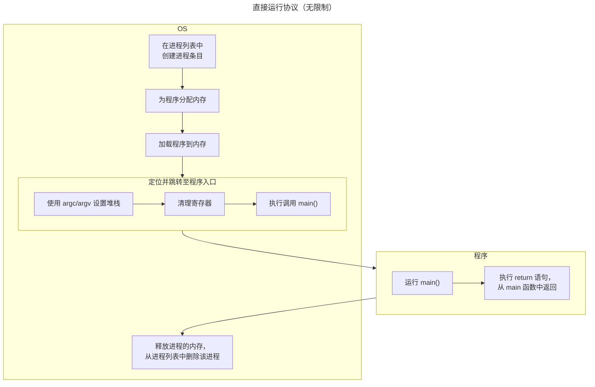

为了虚拟化 CPU，操作系统需要以某种方式让许多任务共享物理 CPU，让这些任务看起来像是同时运行的。基本思想很简单：给每个进程分配一个时间片，一个进程运行一段时间，如果时间片用完了或者提前结束，则切换到其他进程继续运行。通过时分的方式共享 CPU， 实现 CPU 虚拟化。

实现这样的虚拟化机制存在着一些挑战：

1. 性能：如何在不增加系统开销的情况下实现虚拟化？  

2. CPU 控制权：如何高效地运行进程，同时保留操作系统对 CPU 的控制？

   控制权对于操作系统尤为重要，因为操作系统负责资源管理。如果操作系统失去了 CPU 的控制权，一个进程可以简单地无限制运行并接管机器，或访问没有权限的信息。  

在保持控制权的同时获得高性能，这是构建操作系统的主要挑战之一。  

## 6.1 基础技术：受限制的直接执行

为了让程序跑的尽可能的快，OS 开发者想出了一种称为 “限制直接执行技术”。**直接执行** 的思路是简单的：让程序直接在 CPU 上运行。操作系统启动一个程序的过程：首先在进程列表中创建一个进程条目[^process-entry]，然后为这个新创建的进程分配内存，将用户程序代码加载到内存（新进程的内存）中。定位跳转到程序入口[^entry-point] (在 C 语言中，程序的入口是 `main()` 函数)，将 CPU 控制权转交给用户程序，这时用户程序开始运行，直到运行至程序出口或者遇到异常时，将 CPU 的控制权交还给操作系统。

虽然直接执行技术的实现听起来很简单，但是使用这种技术去实现 CPU 虚拟化会存在一些问题。

* 如果我们只运行一个程序，操作系统如何确保高效地运行这个程序的同时，不让它做任何我们不想让它做的事？
* 当我们运行一个进程时，操作系统如何让它停止运行并切换到另一个进程，从而实现时分共享 CPU，达到虚拟化 CPU 的目标？

在开发这些技术时，我们会明白标题中的“受限”部分来自哪里。如果运行一个程序而不对它施加任何限制，操作系统将无法控制任何事情，这样的操作系统“仅仅是一个库”而已。

## 6.2 问题 1：受限制的操作

直接执行的一个明显优势是快。程序直接在硬件 CPU 上运行，因此执行速度与预期的一样快。但是，在 CPU 上运行会带来一个问题：如果进程希望执行某种受限制的操作（如向磁盘发起 I/O 请求或者获得更多系统资源（如 CPU 或内存）），该怎么办？ 

* 一种方法就是：让进程做任何它想做的事。但是，这样做导致无法构建许多我们想要的系统。例如，当我们想构建一个有权限的文件系统时，就不能简单地让任何用户进程向磁盘发出 I/O。如果这么做，一个进程就可以对整个磁盘进行读写，这样所有的保护都会失效。

* 因此，我们采用的方法是引入一种新的处理器模式：用户模式[^user-mode]。[CPU 模式](https://en.wikipedia.org/wiki/CPU_modes)分为两类：

  * 用户模式：在用户态下运行的代码会受到限制。例如，在用户模式下运行时，进程不能发起 I/O 请求。这样做会导致处理器抛出异常，操作系统可能会终止进程；

  * 内核模式[^kernel-mode]：操作系统（或内核）就以这种模式运行。运行在该模式的代码，可以执行任何操作，包括特权操作，比如发起 I/O 请求和执行各种受限制的指令。

但是，我们仍然面临着一个挑战——如果用户希望执行某种特权操作（如从磁盘中读取数据），应该怎么做？为了实现这一点，几乎所有的现代硬件都提供了用户程序执行**系统调用**[^system-call]的能力。  系统调用允许内核小心地向用户程序暴露某些关键功能，例如访问文件系统、创建和销毁进程、与其他进程通信，以及分配更多内存。

要执行系统调用，程序必须执行一条特殊的 **trap 指令** [^trap-instruction]。这条指令跳转到内核的同时会将权限级别提升到内核模式；一旦进入内核，系统就可以执行所需的特权操作（如果被允许），从而完成调用进程所需的工作。完成后，操作系统调用一个特殊的 **return-from-trap 指令**[^return-from-trap-instruction]，返回到调用的用户程序，同时将权限级别降回用户模式。

在执行陷阱时，硬件要确保有足够的堆栈空间保存的调用者寄存器，以便在操作系统发出 return-from-trap 指令时能够正确返回到用户模式。例如，在 x86 架构上，处理器会将程序计数器、标志寄存器和一些其他寄存器推送到每个进程的内核栈上；从陷阱返回指令会从堆栈指针寄存器中弹出这些值，并继续执行用户模式程序。

在这个讨论中，还有一个重要的细节没有提到：<u>陷阱如何知道在操作系统内部运行哪个代码？</u>

内核通过在启动时设置**陷阱表**来实现这一点。当计算机启动时，操作系统以特权（内核）模式启动，因此可以自由配置机器硬件。因此，操作系统所做的第一件事情之一是告诉硬件在发生某些异常事件时运行哪些代码。例如，当硬盘中断发生时，当键盘中断发生时，或当程序进行系统调用时应该运行哪些代码？操作系统通常使用某种特殊指令来通知硬件这些陷阱处理程序的位置。硬件会记住这些处理程序的位置，直到下次机器重新启动，因此硬件知道在系统调用和其他异常事件发生时要执行什么代码（即要跳转到哪个代码）。

为了指定确切的系统调用，通常为每个系统调用分配一个系统调用号。因此，用户代码负责将所需的系统调用号放入一个寄存器或指定的堆栈位置；当操作系统在陷阱处理程序内处理系统调用时，它会检查这个号码，确保它是有效的，如果是有效的，则执行相应的代码。这种间接级别作为一种保护机制；用户代码不能指定要跳转到的确切地址，而是必须通过编号请求特定的服务。

**受限制的直接执行**（LDE）协议中有两个阶段。

* 在第一个阶段（在引导时），内核初始化陷阱表，并且 CPU 会记住它的位置以供后续使用。内核通过一条特权指令来完成这个操作。
* 在第二阶段（运行进程时），内核在开始执行进程之前设置了一些东西（例如，在进程列表上分配一个节点，分配内存）；然后使用从陷阱返回指令来启动进程的执行；这将把CPU切换到用户模式并开始运行进程。

## 6.3 问题 2：进程间的切换

## 6.4 担心并发吗？

## 6.5 小结

我们已经描述了一些实现CPU虚拟化的关键底层机制，这些技术集合起来被称为有限制的直接执行。基本思想很简单：只需在CPU上运行你想运行的程序，但首先确保设置硬件以限制进程在没有操作系统协助的情况下所能做的事情。

[^process-entry]: 进程条目：指的是操作系统中的数据结构或记录，用于表示和管理一个正在运行或即将运行的进程。这个记录通常包括有关进程的各种信息，如进程标识符、进程状态、内存分配信息等，以便操作系统能够有效地管理和控制各个进程的执行。
[^entry-point]: 程序入口:  也称为“入口点”或“主入口点”，是计算机程序代码中的特定位置，程序从这个位置开始执行。它是程序执行的起点，通常是计算机在运行程序时执行的第一条指令和程序访问命令行参数的地方。

[^user-mode]: 用户模式: CPU的用户模式通常是内核模式下可用功能的一个子集，但在某些情况下，例如硬件模拟非本地体系结构时，它们可能与标准内核模式下可用的功能明显不同。一些CPU体系结构支持多个用户模式，通常具有权限的层次结构。这些体系结构通常被称为基于环的安全性（ring-based security），其中权限的层次结构类似于一组同心环，内核模式位于中心。Multics硬件是环安全性的第一个重要实现，但许多其他硬件平台也沿着类似的路线设计，包括Intel 80286受保护模式和IA-64等，尽管在这些情况下使用不同的名称来描述。
[^kernel-mode]: 内核模式: 在内核模式下，CPU可以执行其体系结构允许的任何操作；可以执行任何指令，启动任何I/O操作，访问内存的任何区域等等。而在其他CPU模式下，硬件会对CPU操作施加一定的限制。通常情况下，某些指令不被允许执行（特别是那些可能改变机器全局状态的指令，包括I/O操作在内），某些内存区域不可访问等等。
[^system-call]: 系统调用: 指运行在用户模式下的程序向操作系统内核请求需要更高权限运行的服务。这可能包括与硬件相关的服务（例如，访问硬盘驱动器或访问设备的摄像头），创建和执行新进程，以及与内核服务（如进程调度）通信。系统调用提供了进程与操作系统之间的重要接口。
[^trap-instruction]: 陷入指令: 也称为陷阱或软件中断，是计算机体系结构中的一种机制，允许程序在执行过程中故意引发异常或中断。陷阱用于各种目的，包括**系统调用**、**错误处理**和**调试**。当执行陷阱指令时，它会导致 CPU 从用户模式切换到内核模式，将控制权转移到操作系统或软件提供的特定处理程序例程。
[^return-from-trap-instruction]: 从陷阱返回指令: 通常称为"陷阱返回"或"从中断返回"，是一种指令，用于退出陷阱、中断或异常处理程序的执行，并将控制返回到最初触发陷阱的程序点。
