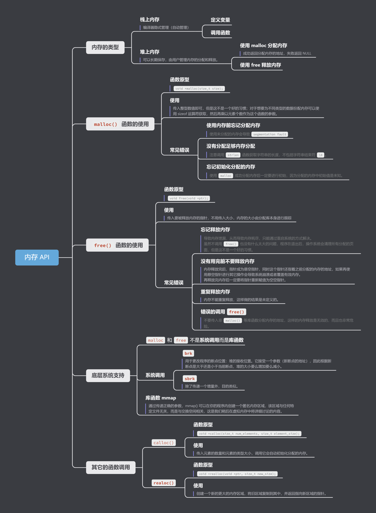

在这个插曲中，我们讨论 UNIX 系统中的内存分配接口。所提供的接口非常简单，因此本章简短而言之。我们要解决的主要问题是：

:::info 如何分配和管理内存

在UNIX/C程序中，了解如何分配和管理内存对于构建健壮可靠的软件至关重要。通常使用哪些接口？应该避免哪些错误？

:::

## 思维导图



## 内存的类型

在运行 C 程序时，存在两种类型的内存分配。第一种被称为**栈内存**，它的分配和释放由编译器隐式地为程序员管理；因此有时它被称为自动内存。

在 C 中声明栈上的内存很容易。例如，假设你在一个名为 func() 的函数中需要一些整数类型的空间，命名为 x。为了声明这样一块内存，你只需像这样做：

```c
void func() {
	int x; // declares an integer on the stack
	...
}
```

编译器会处理其余的工作，在调用 `func()` 时确保在栈上分配空间。当你从函数返回时，编译器会为你释放内存；因此，如果你希望一些信息在调用结束后继续存在，最好不要将该信息留在栈上。

正是对长期内存的需求将我们引入第二种内存类型，称为**堆内存**，其中所有的分配和释放都由程序员显式处理。毫无疑问，这是一个沉重的责任！当然也是许多错误的原因。但如果你小心并且注意，你将能够正确地使用这样的接口而不会遇到太多麻烦。以下是如何在堆上分配整数的示例：

```c
void func() {
    int *x = (int *) malloc(sizeof(int));
    // ...
}
```

关于这个小代码片段有一些注意事项。首先，你可能会注意到在这一行上同时进行了栈分配和堆分配：首先，当编译器看到你声明指针时（`int *x`），它知道要为一个指向整数的指针腾出空间；随后，当程序调用`malloc()`时，它请求在堆上为一个整数分配空间；该例程返回这个整数的地址（成功时），或者返回`NULL`（失败时），然后将其存储在栈上供程序使用。

由于其显式的性质以及更多的用法，堆内存对用户和系统都提出了更多的挑战。因此，它是我们讨论的重点的其余部分。

## `malloc` 函数的使用

`malloc()` 调用非常简单：你传递给它一个大小，请求在堆上获得一些空间，然后它要么成功并返回一个指向新分配空间的指针，要么失败并返回 `NULL`。

手册页显示了你需要使用 `malloc` 的信息；在命令行输入 `man malloc`，你将看到：
```c
#include <stdlib.h>
...
void *malloc(size_t size);
```
从这个信息中，你可以看到你只需要包含头文件 `stdlib.h` 来使用 `malloc`。实际上，你甚至不需要这样做，因为 C 库（默认情况下所有C程序链接的库）已经包含了 `malloc()` 的代码；添加头文件只是让编译器检查你是否正确调用了 `malloc()`（例如，是否传递了正确数量和类型的参数）。

`malloc()` 接受的唯一参数是 `size_t` 类型的，它简单地描述了你需要多少字节。然而，大多数程序员不会直接在这里键入一个数字（例如 10）；事实上，这被认为是一种不好的做法。相反，使用各种例程和宏。例如，要为双精度浮点值分配空间，你可以这样做：
```c
double *d = (double *) malloc(sizeof(double));
```
哇，这真的有点多余！这个 `malloc()` 的调用使用 `sizeof()` 操作符来请求正确的空间量；在 C 中，这通常被认为是一个编译时运算符，意味着实际大小在编译时已知，因此一个数字（在这种情况下，双精度浮点数的大小为 8 字节）被替换为 `malloc()` 的参数。因此，`sizeof()` 被正确地认为是一个运算符而不是函数调用（函数调用将在运行时发生）。

你也可以向 `sizeof()` 传递一个变量的名称（而不仅仅是类型），但在某些情况下，可能得不到期望的结果，所以要小心。例如，让我们看下面的代码片段：
```c
int *x = malloc(10 * sizeof(int));
printf("%d\n", sizeof(x));
```
在第一行中，我们声明了一个包含10个整数的数组的空间，这是很好的。然而，在下一行中使用 `sizeof()` 时，它返回一个较小的值，例如4（在32位机器上）或8（在64位机器上）。原因是在这种情况下，`sizeof()` 认为我们只是在询问一个指向整数的指针有多大，而不是我们动态分配了多少内存。然而，有时 `sizeof()` 的确按照你的期望工作：
```c
int x[10];
printf("%d\n", sizeof(x));
```
在这种情况下，编译器有足够的静态信息，知道已经分配了40字节。

另一个需要小心的地方是处理字符串时。在为字符串声明空间时，请使用以下习惯用语：`malloc(strlen(s) + 1)`，它使用 `strlen()` 函数获取字符串的长度，并在其基础上加 1 以容纳字符串结尾的字符 `'\0'`。在这里使用 `sizeof()` 可能会有问题。

你可能还注意到 `malloc()` 返回一个 `void` 类型的指针。这样做只是C中传递地址并让程序员决定如何处理它的方式。程序员通过使用所谓的“强制转换”来进一步帮助，例如在上面的示例中，程序员将 `malloc()` 的返回类型强制转换为 `double` 类型的指针。强制转换实际上并没有实现任何功能，除了告诉编译器和其他可能阅读你代码的程序员：“是的，我知道我在做什么。”通过对 `malloc()` 的结果进行强制转换，程序员只是提供了一些保证；这个强制转换对于正确性并不是必需的。

## `free()` 函数的调用

事实证明，分配内存是方程中的简单部分；知道何时、如何，甚至是否释放内存是难点。要释放不再使用的堆内存，程序员只需调用 `free()`：
```c
int *x = malloc(10 * sizeof(int));
// ...
free(x);
```
这个例程接受一个参数，即 `malloc()` 返回的指针。因此，你可能注意到，分配区域的大小不是由用户传递的，而是必须由内存分配库本身进行跟踪。

## 常见错误

在使用 `malloc()` 和 `free()` 时会出现一些常见的错误。以下是我们在教授本科操作系统课程时一再看到的一些错误。所有这些例子在编译和运行时都没有引起编译器的任何警告；尽管编译C程序是构建正确C程序所必需的，但这远远不够，你将在实践中学到这一点（通常是通过困难的方式）。

事实上，正确的内存管理一直是一个问题，因此许多较新的编程语言都支持自动内存管理。在这些语言中，虽然你会调用类似于 `malloc()` 的东西来分配内存（通常是 `new` 或类似于分配新对象的东西），但你永远不需要调用类似于 `free` 的东西来释放空间；相反，垃圾收集器会运行并找出你不再引用的内存，并为你释放它。

### 忘记分配内存

许多例程在调用它们之前期望内存已经被分配。例如，`strcpy(dst, src)` 例程将一个字符串从源指针复制到目标指针。然而，如果你不小心，可能会这样做：
```c
char *src = "hello";
char *dst; // 糟糕！未分配内存
strcpy(dst, src); // 段错误并崩溃
```
在这个例子中，`dst` 指针没有被分配内存，而直接调用 `strcpy()` 会导致`segmentation fault`。在使用字符串操作函数之前，确保目标指针指向已分配的内存空间。

在这种情况下，正确的代码可能如下所示：
```c
char *src = "hello";
char *dst = (char *) malloc(strlen(src) + 1);
strcpy(dst, src); // 正常工作
```
或者，你也可以使用 `strdup()` 使生活更加轻松。阅读 `strdup` 手册以获取更多信息。

### 内存分配不足

与之相关的一个错误是没有分配足够的内存，有时称为缓冲区溢出。在上面的例子中，一个常见的错误是几乎为目标缓冲区分配足够的空间。
```c
char *src = "hello";
char *dst = (char *) malloc(strlen(src)); // 太小了！
strcpy(dst, src); // 正常工作
```
奇怪的是，根据 `malloc` 的实现方式和其他许多细节，这个程序通常看起来是正确的运行的。在某些情况下，当字符串复制执行时，它会在已分配空间的末尾多写一个字节，但在某些情况下，这是无害的，也许是覆盖了一个不再使用的变量。在某些情况下，这些溢出可能会非常有害，实际上是系统中许多安全漏洞的根源。在其他一些情况下，malloc 库本身可能会额外分配一些空间，因此你的程序实际上不会在其他变量的值上乱写，而且工作得相当好。在其他情况下，程序确实会崩溃。因此，我们学到了另一个宝贵的教训：即使它曾经正确运行过，也不能说明它是正确的。

:::tip 编译通过或程序运行不一定意味着程序是正确的

尽管程序经过编译甚至运行了一次或多次正确，也不能保证程序是正确的。许多事件可能共同发生，使你认为它正常运行，但后来某些情况发生变化，它就停止工作了。一个常见的学生反应是说（或大喊）
“但之前它是正常的！” 然后责怪编译器、操作系统、硬件，甚至（我们敢说）是教授。但问题通常就在你认为的地方，即在你的代码中。在责怪其他组件之前，先着手调试代码。

:::

### 忘记初始化分配的内存

在这种错误中，你正确调用了 `malloc()`，但忘记向新分配的数据类型填充一些值。不要这样做！如果你确实忘记了，你的程序最终会遇到未初始化读取，从堆中读取一些未知值的数据。谁知道那里可能是什么？如果你幸运，可能是一些使程序仍然正常工作的值（例如，零）。如果你不幸，可能是一些随机而有害的值。

### 忘记释放内存

另一个常见的错误是内存泄漏，它发生在你忘记释放内存时。在长时间运行的应用程序或系统（如操作系统本身）中，这是一个巨大的问题，因为内存慢慢泄漏最终会导致内存耗尽，需要重新启动。因此，通常情况下，当你使用完一块内存时，应确保释放它。请注意，使用垃圾收集语言在这里没有帮助：如果你仍然持有对某块内存的引用，没有垃圾收集器会释放它，因此即使在更现代的语言中，内存泄漏仍然是一个问题。

在某些情况下，似乎不调用 `free()` 是合理的。例如，你的程序是短暂的，并且很快就会退出；在这种情况下，当进程终止时，操作系统将清理所有分配的页面，因此实际上不会发生内存泄漏。虽然这肯定是“有效的”（见第7页的旁注），但这可能是一个不好的习惯，所以要小心选择这样的策略。从长远来看，作为程序员的目标之一是养成良好的习惯；其中之一就是了解如何管理内存，并在像C这样的语言中释放你已经分配的块。即使你可以不这样做，养成释放每一个字节的习惯可能是明智的。

:::info "为什么一旦程序退出就不会有内存泄漏"

当你编写一个短暂运行的程序时，可能会使用 `malloc()` 分配一些空间。程序运行并即将完成：在退出之前是否需要调用一堆 `free()` 呢？虽然感觉不调用是不对的，但在任何实际意义上都不会“丢失”内存。原因很简单：系统中实际上有两个层次的内存管理。第一层内存管理是由操作系统执行的，当进程运行时，操作系统分配内存给它们，并在进程退出时（或以其他方式终止时）收回内存。第二层管理是在每个进程内部进行的，例如在堆中调用 `malloc()` 和 `free()` 时。即使你未调用 `free()`（从而在堆中泄漏内存），操作系统在程序运行结束时将重新收回该进程的所有内存（包括代码、堆栈和堆等页面）。无论你的地址空间中的堆的状态如何，操作系统在进程终止时将取回所有这些页面，从而确保没有内存丢失，尽管你没有释放它。

因此，对于短暂运行的程序，泄漏内存通常不会引起任何操作问题（尽管可能被视为不良形式）。当你编写一个长时间运行的服务器（如 Web 服务器或数据库管理系统，永不退出）时，泄漏的内存是一个更大的问题，并最终会导致应用程序耗尽内存时崩溃。当然，在一个特定程序内泄漏内存是一个更大的问题：操作系统本身。再次告诉我们：那些编写内核代码的人面临的是最艰巨的任务...

:::

### 释放内存时要确保你使用完它

有时候程序会在完成使用之前释放内存；这样的错误被称为悬空指针，正如你猜测的那样，这也是一个坏事。后续使用可能会导致程序崩溃，或覆盖有效内存（例如，你调用了 `free()`，但接着又调用了 `malloc()` 分配了其他的东西，然后重新使用了错误释放的内存）。

### 重复释放内存

有时程序会释放内存多次；这被称为双重释放。这样做的结果是未定义的。可以想象，内存分配库可能会混淆，执行各种奇怪的操作；崩溃是一个常见的结果。

### 错误地调用 `free()`

最后讨论的一个问题是错误地调用 `free()`。毕竟，`free()` 只希望你传递给它之前从 `malloc()` 接收到的指针之一。当你传递其他值时，可能会发生不好的事情。因此，这样的无效释放是危险的，当然也应该避免。

### 总结

正如你所看到的，滥用内存的方法有很多。由于内存频繁出现错误，一整套工具已经发展出来，帮助你在代码中找到这些问题。查看 purify 和 valgrind，两者都在帮助你定位与内存相关的问题方面表现出色。

## 底层操作系统支持

你可能已经注意到，当讨论 `malloc()` 和 `free()` 时，我们并没有谈论系统调用。这是因为它们并不是系统调用，而是库调用。因此，`malloc` 库在虚拟地址空间内管理空间，但它本身是在一些系统调用的基础上构建的，这些系统调用会向操作系统请求更多内存或将一些内存释放回系统。

其中一个这样的系统调用被称为 `brk`，它用于更改程序的断点位置：堆的结束位置。它接受一个参数（新断点的地址），因此根据新断点是大于还是小于当前断点，堆的大小要么增加要么减小。另一个调用 `sbrk` 除了传递一个增量外，目的类似。

请注意，你绝对不应直接调用 `brk` 或 `sbrk`。它们由内存分配库使用；如果尝试使用它们，可能会导致一些（极其严重的）问题。请使用 `malloc()` 和 `free()`。

最后，你还可以通过 `mmap()` 调用从操作系统获取内存。通过传递正确的参数，`mmap()` 可以在你的程序内创建一个匿名内存区域，该区域与任何特定文件无关，而是与交换空间相关，这是我们稍后在虚拟内存中将详细讨论的内容。然后，这块内存也可以像堆一样对待并进行管理。阅读 `mmap()` 的手册页以获取更多详细信息。

## 其它的函数调用

内存分配库还支持一些其他调用。例如，`calloc()` 分配内存并在返回之前将其清零；这可以防止一些错误，其中你假设内存已被清零，却忘记自己进行初始化（参见上文关于“读取未初始化的内存”的段落）。例程 `realloc()` 也很有用，当你为某些东西（比如一个数组）分配了空间，然后需要向其添加一些内容时：`realloc()` 创建一个新的更大的内存区域，将旧区域复制到其中，并返回指向新区域的指针。

## 总结

我们介绍了一些处理内存分配的 API。和往常一样，我们只是涉及了基础知识；更多细节可以在其他地方找到。阅读 C 语言的经典著作《The C Programming Language》和 Stevens 的《Advanced Programming in the UNIX Environment》（第7章）获取更多信息。对于如何自动检测和纠正许多这些问题的一篇现代而有趣的论文，请参阅 Novark 等人的《Automatic Program Repair with Evolutionary Computation》；这篇论文还包含了对常见问题的良好总结以及一些有关如何找到和修复它们的聪明想法。
