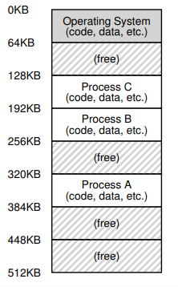

在早期，因为用户的期望并不高, 所以构建计算机系统是件轻松的事。正是那些该死的用户，他们对“易用性”、“高性能”、“可靠性”等的期望，真的导致了所有这些头疼的问题。下次你遇到其中一个计算机用户时，感谢他们引发的所有问题吧。

## 思维导图


## 早期系统

从内存的角度来看，早期的计算机并没有为用户提供太多的抽象。基本上，机器的物理内存看起来有点像你在图 13.2 中看到的那样。

操作系统是一组例程（实际上是一个库），位于内存中（在这个例子中从物理地址 0 开始），并且会有一个正在运行的程序（一个进程）当前位于物理内存中（在这个例子中从物理地址 64k 开始），并使用其余的内存。这里几乎没有什么幻想，用户对操作系统的期望也不高。在那些日子里，操作系统开发者的生活确实很轻松，不是吗？


## 多程序设计和分时系统

随着时间的推移，由于计算机价格昂贵，人们开始更有效地共享机器。因此，多程序设计的时代诞生了，在这个时代，多个进程在同一时间准备运行，操作系统会在它们之间切换，例如当一个进程决定执行 I/O 操作时。这样做增加了 CPU 的有效利用率。在那个时代，每台机器的成本都达到了数十万甚至数百万美元（你可能觉得你的 Mac 很昂贵了！），因此提高效率尤为重要。

然而，很快人们开始对计算机提出更多要求，于是分时系统的时代诞生了。具体而言，许多人意识到批处理计算的局限性，尤其是对程序员自身的限制，他们厌倦了漫长（因此低效）的程序调试周期。交互性的概念变得重要起来，因为许多用户可能同时使用一台机器，每个人都在等待（或希望）从当前正在执行的任务中得到及时的响应。

实现分时系统的一种方式是运行一个进程一小段时间，让它完全访问所有内存（图 13.2），然后停止它，将其所有状态保存到某种磁盘中（包括所有物理内存），加载其他一些进程的状态，运行它一段时间，从而实现对机器的某种粗糙共享。

不幸的是，这种方法存在一个很大的问题：它太慢了，尤其是随着内存的增长。虽然保存和恢复寄存器级状态（PC、通用寄存器等）相对较快，但将整个内存内容保存到磁盘上的性能非常差。因此，我们更愿意在进程切换时将进程保留在内存中，使操作系统能够高效地实现分时系统（如图 13.3 所示）。

在图中，有三个进程（A、B 和 C），每个进程都有专门分配给它的 512KB 物理内存的一小部分。假设只有一个 CPU，操作系统选择运行其中一个进程（比如 A），而其他的进程（B 和 C）则在就绪队列中等待运行。随着分时系统的普及，你可能猜到对操作系统提出了新的需求。特别是，允许多个程序同时驻留在内存中使得保护成为一个重要问题；你不希望一个进程能够读取，更糟糕的是写入其他某个进程的内存。



## 地址空间

然而，我们必须牢记那些讨厌的用户，**为此操作系统需要创建一个易于使用的物理内存抽象。我们将这种抽象称为地址空间，它是运行程序在系统中对内存的视图。** 理解这个内存的基本操作系统抽象对于理解内存如何虚拟化至关重要。

**一个进程的地址空间包含了运行程序的所有内存状态。** 例如，程序的代码（指令）必须存在于内存中的某个地方，因此它们就在地址空间中。程序在运行时使用栈来跟踪函数调用链中的位置，以及分配局部变量并传递参数和函数返回值。最后，堆用于动态分配、由用户管理的内存，比如在 C 语言中调用 malloc() 或在面向对象语言如 C++ 或 Java 中使用new 时可能获得的内存。当然，还有其他一些东西（例如，静态初始化的变量），但现在**让我们暂时假设这三个组成部分：代码、栈和堆。**

在图 13.4 的示例中，我们有一个小小的地址空间（只有16KB）。程序代码位于地址空间的顶部（在这个例子中从 0 开始，并打包到地址空间的前 1K）。代码是静态的（因此易于放置在内存中），因此我们可以将它放在地址空间的顶部，并知道随着程序运行，它不会需要更多的空间。


接下来，我们有两个在程序运行时可能增长（和缩小）的地址空间区域。它们是堆（在顶部）和栈（在底部）。我们之所以这样放置它们，是因为它们都希望能够增长，通过将它们放在地址空间的相反端点，我们可以允许这种增长：它们只需以相反的方向增长。因此，堆从代码的后面开始（在 1KB 处），向下增长（例如，当用户通过 malloc() 请求更多内存时）；栈从 16KB 开始向上增长（例如，当用户进行过程调用时）。然而，这种放置栈和堆的方式只是一种约定；如果你愿意的话，你可以以不同的方式排列地址空间（如我们稍后将看到的，当多个线程共存于一个地址空间时，像这样划分地址空间的方式不再适用）。

当我们描述地址空间时，我们描述的是操作系统为运行中的程序提供的抽象。程序实际上并没有加载到物理地址0到16KB的内存中；相反，它被加载到某个任意的物理地址（或多个地址）上。查看图13.2中的进程A、B和C；你可以看到每个进程是如何被加载到内存的不同地址的。因此，问题来了：

::: info 如何虚拟化内存

操作系统如何在单一物理内存的基础上为多个运行中的进程（共享内存）构建这样一个私有、尽可能大的地址空间抽象呢？

:::

当操作系统执行这一步骤时，我们说操作系统正在虚拟化内存，因为运行中的程序认为它被加载到内存的特定地址（比如 0），并且具有一个可能非常大的地址空间（比如 32 位或 64位）；而实际情况却是完全不同的。
例如，在图 13.3 中，进程 A 尝试在地址 0 处执行加载操作（我们称之为虚拟地址），**一些硬件支持的配合下，操作系统必须确保加载实际上并不是发生在物理地址 0，而是在物理地址 320KB（A 被加载到内存中的位置）**。这是内存虚拟化的关键，是全球每个现代计算机系统的基础。

## 目标

因此，我们来到操作系统在这组笔记中的任务：虚拟化内存。操作系统不仅仅要虚拟化内存，还要以一种有风格的方式来实现。为了确保操作系统能够做到这一点，我们需要一些目标来指导我们。我们之前已经见过这些目标（想想引言），而且我们将再次看到它们，但它们确实值得重复。

**虚拟内存系统的一个主要目标是透明性。** 操作系统应该以对运行中程序不可见的方式实现虚拟内存。因此，程序不应该意识到内存被虚拟化的事实；相反，程序的行为应该表现得像它拥有自己的私有物理内存一样。在幕后，操作系统（和硬件）完成了在许多不同作业之间进行内存复用的所有工作，从而实现了这种幻觉。

**虚拟内存的另一个目标是效率。** 操作系统应该努力使虚拟化尽可能高效，无论是从时间的角度（即，不要使程序运行得更慢）还是从空间的角度（即，不要使用太多内存来支持虚拟化所需的结构）。在实现高效时间的虚拟化时，操作系统将不得不依赖硬件支持，包括硬件特性如 TLBs（我们将在适当的时候学到）。

最后，**虚拟内存的第三个目标是保护**。操作系统应确保防止进程之间的相互干扰，同时保护操作系统免受进程的影响。当一个进程执行加载、存储或指令提取时，它不应该能够以任何方式访问或影响其他进程或操作系统本身的内存内容（即，任何超出其地址空间的内容）。保护使我们能够实现进程之间的隔离属性；每个进程应该在自己的孤立空间中运行，免受其他有缺陷或甚至恶意进程的影响。

:::tip 隔离原则

隔离是构建可靠系统的关键原则。如果两个实体得到了适当的隔离，这意味着其中一个出现故障不会影响另一个。操作系统致力于将进程相互隔离，以防止一个进程对另一个进程造成危害。通过使用内存隔离，操作系统进一步确保运行中的程序无法影响底层操作系统的运行。一些现代操作系统甚至通过将操作系统的一部分与另一部分隔离开来，进一步提高了隔离性。这样的微内核可能比典型的单片内核设计具有更高的可靠性。

:::

在接下来的章节中，我们将重点探讨虚拟化内存所需的基本机制，包括硬件和操作系统的支持。我们还将研究一些在操作系统中遇到的更相关的策略，包括如何管理空闲空间以及在内存空间不足时应将哪些内存页踢出内存。通过这样做，我们将逐渐增强你对现代虚拟内存系统运作原理的理解。

## 总结

我们已经介绍了一个重要的操作系统子系统：虚拟内存。**虚拟内存系统负责为每个运行中的程序提供一个大、稀疏、私有的地址空间的幻觉**；每个虚拟地址空间都包含程序的所有指令和数据，程序可以通过虚拟地址引用它们。操作系统在一些硬件帮助下，将每个虚拟内存引用转换为物理地址，然后将其呈现给物理内存，以获取或更新所需的信息。操作系统将为许多进程提供这项服务，确保相互之间以及保护操作系统免受影响。整个方法需要大量的机制（即，许多底层机制）以及一些关键的策略才能运作；我们将从底层开始，首先描述关键的机制。因此，我们继续进行！

:::info 我们看到的所有地址都是虚拟的

曾经编写过一个打印指针的C程序吗？你看到的值（通常以十六进制打印的一个大数值）就是虚拟地址。有没有想过你的程序的代码在哪里？你也可以打印出来，是的，如果你能打印它，它也是一个虚拟地址。实际上，作为用户级程序员可以看到的任何地址都是虚拟地址。只有操作系统通过其巧妙的内存虚拟化技术，才知道这些指令和数据值在计算机的物理内存中的位置。因此永远不要忘记：如果在程序中打印出一个地址，它就是一个虚拟地址，是内存中事物布局的一种幻觉；只有操作系统（和硬件）知道真相。

这里有一个小程序（va.c），它打印出main()函数的位置（代码所在的地方），从malloc()返回的堆分配值的值，以及栈上整数的位置：

```c
#include <stdio.h>
#include <stdlib.h>

int main(int argc, char *argv[]) {
	printf("location of code : %p\n", main);
	printf("location of heap : %p\n", malloc(100e6));
	int x = 3;
	printf("location of stack: %p\n", &x);
	return x;
}

```

当在 64 位的 Mac 上允许时，我们可以看到以下输出结果：

```
location of code : 0x1095afe50
location of heap : 0x1096008c0
location of stack: 0x7fff691aea64
```

从这个例子中，你可以看到代码首先出现在地址空间中，然后是堆，而栈则位于这个大虚拟空间的另一端。所有这些地址都是虚拟地址，将由操作系统和硬件进行转换，以从它们真实的物理位置获取值。

:::
