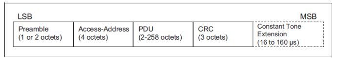
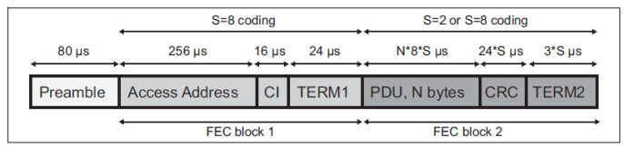
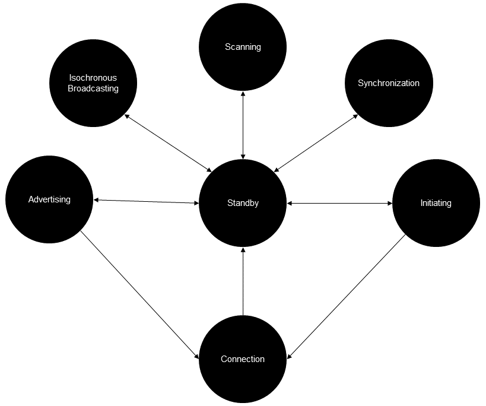

## 思维导图

## 链路层概览

链路层规范几乎是蓝牙核心规范中 BLE 部分中最大的部分，仅次于主机控制器接口功能规范部分。然而可以说，它是最复杂的部分。

链路层有许多责任。它定义了通过空中传输的多种数据包和相关的空中接口协议。它的操作受到明确定义的状态机的影响。根据状态的不同，链路层可能以多种不同的方式运行，由多种类型的事件驱动。定义了许多影响链路状态或链路使用参数的控制过程。链路层规范中还定义了无线信道的选择和分类。

链路层支持连接和无连接的通信，以及确定性和（稍微）随机化的事件定时。支持两个设备进行点对点通信和一对多的通信模式（一个设备发送的消息，多个设备可以同时接收。）

## 数据包格式

链路层定义了两种数据包格式。

* 第一种是非编码的物理层使用的数据包格式（LE 1M 和 LE 2M）：

  

* 第二种是编码的物理层使用的数据包格式 （LE Coded S=2 和 LE Coded S=8）：

  

两种数据包类型都包括前导码、接入地址和CRC字段。表1解释了这些共同字段的每个部分。

**表一. 链路层数据包格式共有字段**

| 链路层数据包字段名称 | 描述                                                         |
| -------------------- | ------------------------------------------------------------ |
| 前导码               | 前导码允许接收器精确同步信号的频率，执行自动增益控制并估算符号定时。 |
| 接入地址             | 接收方用接入地址区分信号和背景噪音，并确定数据包跟接收设备的相关性。例如，一对连接的设备交换具有相同随机分配的接入地址的数据包。未参与连接的设备将忽略此类数据包，因为接入地址与它们不相关。同样，所有传统的广播数据包都使用相同的接入地址，值为 0x8E89BED6，这表示这些数据包可被所有设备接收。 |
| CRC                  | 循环冗余校验（CRC）用于错误检测。发射方使用数据包中其他位的值来计算其值。在接收到一个数据包时，接收设备会根据接收到的数据包的位值计算出一个CRC值，除了构成 CRC 字段的那些位。然后，接收方计算得到的 CRC 值与数据包中 CRC 字段的值进行比较。如果两个 CRC 值匹配，那么数据包被认为已正确接收。如果不匹配，则被认为包含一个或多个错误位。 |

链路层数据包的 PDU 字段可能包含各种不同的协议数据单元（PDUs），具体取决于 BLE的使用方式。当使用两种定向找寻方法之一（到达角或离开角）时，才会存在 Constant Tone Extension（CTE）。

在数据包传输之前，PDU 和 CRC 字段会经过一种称为白化的过程。白化[^whitening]的目的是避免数据包中出现长序列的 0 或 1，因为这可能导致接收方的频率锁定漂移。接收方会反转白化过程，以在检查 CRC 之前恢复原始的位流。

PDU 字段可能会进行加密，此时它包括一个消息完整性检查字段，用于防止 PDU 被篡改。

在使用 LE Coded PHY 时，比特流在传输前会受到额外的处理。首先应用前向纠错（FEC）编码器，然后通过模式映射器生成额外的数据，接收方在逆向应用这些过程时使用该数据，并在可能的情况下纠正任何具有不正确值的位。

## 状态机

链路层由如图 4 所展示的状态机来管理。

请参考链路层规范以获取每个状态的详细信息。**表二**中提供了一个摘要。请注意，此部分的某些术语将在后面的内容中进行解释。

**表二. 链路层状态**

| 状态                    | 描述                                     |
| ----------------------- | ---------------------------------------- |
| 待机（Standby）         | 设备即不发送数据包也不接收数据包         |
| 发起连接 （Initiating） | 响应来自特定设备的广播包以请求建立连接。 |
| 广播 （Advertising）    | 发送广播包并处理其他设备的响应广播包。   |
| 连接 （Connection）     | 与另一设备建立了连接。                   |
| 扫描 （Scanning）       | 监听来自其它设备广播包                   |
| 等时广播                | 广播等时数据包。                         |
| 同步                    | 监听特定设备传输的特定广播的周期性广播。 |

在连接状态时，BLE 定义了两个重要的设备角色，分别是中心角色（central role）和外围角色。发起连接并从初始化状态过渡到连接状态的设备承担中心角色（peripheral role）。接受连接请求，从广播状态过渡到连接状态的设备承担外围角色。

以智能手机为例，该手机包括音乐播放器应用和便携式蓝牙 LE 音箱。通常，智能手机将扮演中心角色，音箱将扮演外围角色。智能手机通过扫描音箱的广告数据包发现音箱，然后通常在用户的参与下启动与音箱的连接。一旦连接，按照相关 LE 音频规范中定义的附加过程，然后建立音频流。

一个状态机实例某一时刻只能处于一种状态。链路层的实现可以支持多个状态机实例并发运行。

并不是所有的角色和状态都可以任意组合。可以去阅览蓝牙核心规范了解更多细节。

## 信道选择

BLE 将 2.4 GHz频段划分为 40 个信道。链路层控制这些信道的使用方式，这反过来取决于蓝牙低功耗用于通信的总体方式（更正式地说，这在第 7 节数据传输体系结构中有所涉及）。

蓝牙低功耗以多种不同的方式使用频谱扩展技术，在一段时间内通过多个信道传输数据。这降低了碰撞的几率，使通信更可靠。

BLE 中使用的一种著名的频谱扩展技术是自适应频率跳频。这涉及用于数据包通信的无线电信道定期更改。**通过使用信道选择算法和称为信道映射的数据表来选择信道，该表将每个信道分类为已使用或未使用**。实现可以监视每个信道上的通信质量，如果发现某个信道的性能不佳，可能是由于来自其他源的干扰，可以更新信道映射以将该信道的分类设置为未使用，从而确保该信道不再被算法选择。通过这种方式，通道选择算法能够适应当前的条件，并优化以获得最可靠的性能。、

有关如何使用无线电信道的详细信息将在下文讨论 BLE 逻辑传输及其相关物理信道时进一步描述。

## 数据传输架构

## 术语

[^whitening]: 白化: 白化的目的就是降低输入的冗余性。
