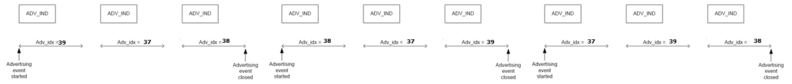
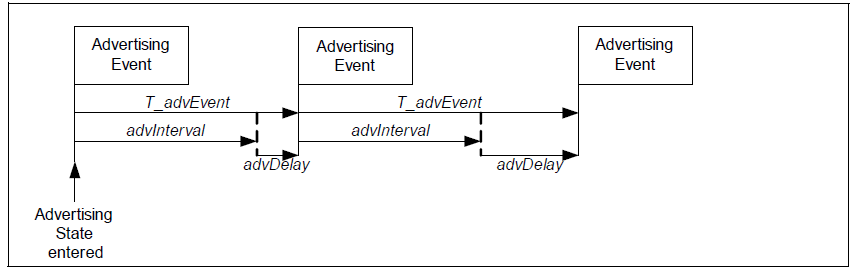
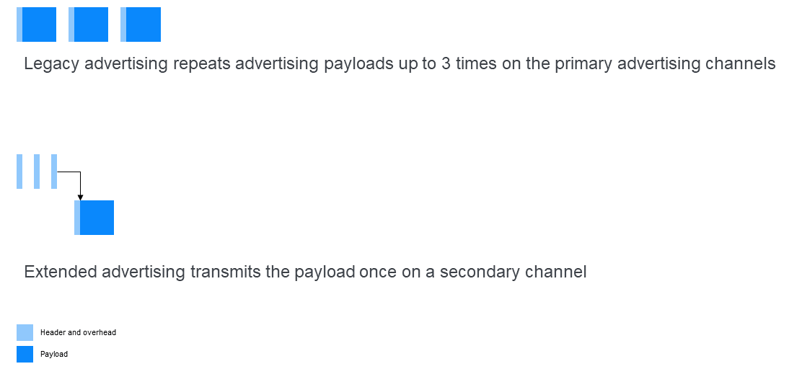
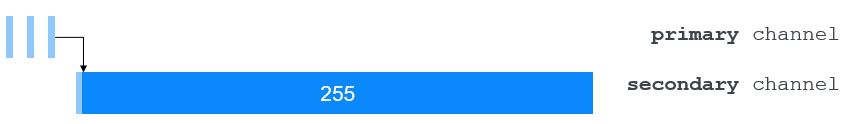
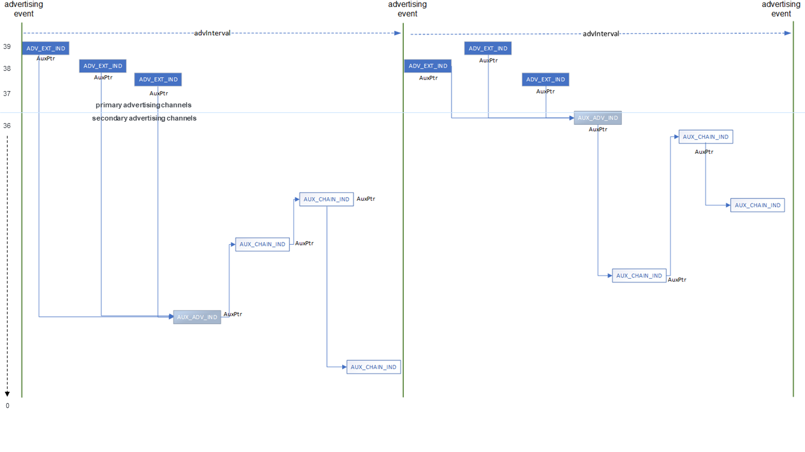

## 基础

LE 广播（或简称广播）提供了一种无连接的通信模式。它可用于传输数据或指示外围设备的可连接性。通常，广播数据包旨在被范围内的任何扫描设备接收，因此广播可以用于同时向多个扫描设备传输数据，形成一对多的拓扑结构。然而，还定义了一种称为定向广播的特殊形式，允许从一个广播设备无连接地向一个特定的扫描设备传输数据，该设备由其蓝牙设备地址标识。

广播本身仅支持单向数据通信，从广播设备到扫描设备，但这些设备可以通过 PDU 回复广播数据包，请求进一步的信息或建立连接。当扫描设备通过回复来获取更多信息时，称为主动扫描。当不回复时，称为被动扫描。

广播通常被称为一种不可靠的传输，因为接收方不会发送确认。

蓝牙核心规范中定义了两种广播程序，分别被称为传统广播（legacy advertising）和扩展广播（extended advertising）。

## 传统广播（Legacy Advertising）

### 信道使用和数据包大小

使用 ADV_IND PDU 类型的传统广播数据包（请参阅 [2.3 传统广播和相关 PDU 类型](#传统广播和相关 PDU 类型)）的长度为 37 个字节，其中包括一个 6 个字节的头部和最多 31 字节的有效载荷。广播数据包的相同副本通过最多三个专用信道（编号为 37、38 和 39，称为主广播信道）之一以某种顺序逐个传输。

### 调度

每次广播事件发生时，进行广播数据包的传输。广播事件的调度受到定时参数的控制，在基本情况下，有意的将调度设计为略微不规律的，以避免与其他广播设备发生持续的碰撞。在每个广播事件中，将 advDelay 分配一个伪随机值，该值在 0 - 10 毫秒的范围内，并将其添加到常规广播间隔（advInterval）中，以便扰动广播事件的时间。图 15 重现了蓝牙核心规范第 6 卷B部分中的图 4.5，并说明了 advDelay 参数的效果。

以这种方式调度广播事件有助于避免碰撞，但也使得接收器更难以高效接收广播数据包，需要更高的接收（RX）占空比以适应广播事件的不可预测时序。

### 传统广播和相关 PDU 类型

为传统广播定义了多种 PDU 类型。不同类型的 PDU 用于无定向广播，其中数据包面向任何扫描设备，以及有定向广播，其中数据包寻址到一个特定设备。PDU 类型还指示是否允许主动扫描，接收器是否会回复并请求更多数据，以及广播设备是否可以被连接。**所有传统广播都在主广播信道 37、38 和 39 中的一个或多个上进行，并且只能使用 LE 1M PHY**。

<table>
	<caption>表一. 传统广播 PDU 类型列表</caption>
    <tr>
        <th>PDU 名称</th>
        <th>描述</th>
        <th>信道</th>
        <th>PHY 类别</th>
        <th>发送角色</th>
        <th>可扫描</th>
        <th>可连接</th>
    </tr>
    <tr>
        <td>ADV_IND</td>
        <td>不定向广播</td>
        <td>主信道</td>
        <td>LE 1M</td>
        <td>外围设备</td>
        <td>是</td>
        <td>是</td>
    </tr>
    <tr>
        <td>ADV_DIRECT_IND</td>
        <td>定向广播</td>
        <td>主信道</td>
        <td>LE 1M</td>
        <td>外围设备</td>
        <td>否</td>
        <td>是</td>
    </tr>
    <tr>
        <td>ADV_NONCONN_IND</td>
        <td>不定向、不可连接、不可扫描的广播</td>
        <td>主信道</td>
        <td>LE 1M</td>
        <td>外围设备</td>
        <td>否</td>
        <td>否</td>
    </tr>
    <tr>
        <td>ADV_SCAN_IND</td>
        <td>不定向可扫描广播</td>
        <td>主信道</td>
        <td>LE 1M</td>
        <td>外围设备</td>
        <td>是</td>
        <td>否</td>
    </tr>
    <tr>
        <td>SCAN_REQ</td>
        <td>扫描请求</td>
        <td>主信道</td>
        <td>LE 1M</td>
        <td>中央设备</td>
        <td>N/A</td>
        <td>N/A</td>
    </tr>
    <tr>
        <td>SCAN_RSP</td>
        <td>扫描响应</td>
        <td>主信道</td>
        <td>LE 1M</td>
        <td>外围设备</td>
        <td>N/A</td>
        <td>N/A</td>
    </tr>
    <tr>
        <td>CONNECT_REQ</td>
        <td>连接请求</td>
        <td>主信道</td>
        <td>LE 1M</td>
        <td>中央设备</td>
        <td>N/A</td>
        <td>N/A</td>
    </tr>
</table>

蓝牙核心规范中链接层规范章节的第 4.4 节详细介绍了所有广播 PDU 类型的信息。

## 扩展广播（Extended Advertising）

蓝牙核心规范第 5 版引入了一些关于如何执行广播的重大变化。新增了八种与广播、扫描和连接相关的PDU以及定义了新的过程。这组新的广播能力集合被统称为扩展广播。

扩展广播允许广播更大量的数据，按确定性的时间表执行广播，并传输由不同配置管理的多组不同的广播数据。它在竞争和占空比方面也提供了显著的改进。

ADV 广播者（ADVB）和 PADVB 逻辑传输都可以使用扩展广播。

### 信道和数据包大小

扩展广播使用主广播信道的方式与传统广播不同，其中主广播信道 37、38 和 39 携带较少的数据，而通用信道 0 - 36 携带大部分数据。

如[第二小节传统广播](#传统广播-legacy-advertising)中所述，**传统广播在三个不同的主广播信道上最多可以传输三次相同的有效载荷。扩展广播只传输有效载荷数据一次**，小的数据头部通过主广播信道传输。因此，传输的数据总量比使用传统广播的等效情况少，因此有效占空比降低。

扩展广播允许数据包的长度最多为 255 个字节。这部分是通过将有效载荷转移到 0-36 信道编号范围内的一个通用信道来实现的。

在执行扩展广播时，只有头部数据被传输到 37、38 和 39 号主广播信道上。其中包括一个 AuxPtr 的字段。

AuxPtr 字段引用一个关联的辅助数据包，其中包含将在从 0 到 36 号信道中选择的一个通用信道上传输的有效载荷。AuxPtr 包括通用信道索引，指示将在其上传输辅助数据包的信道，以便接收方知道在哪里找到它。在主广播信道上的包引用 AuxPtr 字段的通过 AuxPtr 引用的通用信道上传输的数据包称为从属数据包，而引用的包称为上级数据包。

在 AuxPtr 中选择信道索引值是与实现相关的，蓝牙核心规范仅建议“使用足够的信道差异来避免碰撞”。

### 数据包链式传输

在那些应用需要广播更多数据的情况下（最多 1,650 字节），控制器可以对数据进行分段并将数据包链接在一起，其中每个数据包包含数据的一个子集。每个链接的数据包可以在不同的信道上传输，AuxPtr 头字段引用链中的下一个数据包。图 5 说明了这一过程。

### 广播集

传统广播未对广播有效负载和参数进行正式规定，不允许它们变化。而扩展广播包括了一种标准机制，用于拥有多组独立的广播数据。

广播集有一个 ID，用于指示给定数据包属于哪个集合，每个集合都有自己的广播参数，如广播间隔和要使用的 PDU 类型。

安排和传输不同集合的任务由控制器中的链路层负责，而不是由主机驱动，这将更加节能。主机只需最初通知控制器有关广播集及其各自参数，之后链路层接管这些任务。

### 周期性广播

扩展广播包括一种使用确定性调度的广播方法，其详细信息可以被扫描设备发现并同步。这被称为周期性广播（Periodic Advertising）。周期性广播被定义为一个独立的逻辑传输，因此在[第四节 PADVB - LE 周期性广播](./periodic_adv)中进行了描述。

### 扩展广播和相关 PDU 类型

<table>
    <caption>表二. 扩展广播 PDU 类型</caption>
    <tr>
        <th>PDU 名称</th>
        <th>描述</th>
        <th>信道</th>
        <th>PHY</th>
        <th>发送角色</th>
    </tr>
    <tr>
        <td>ADV_EXT_IND</td>
        <td>扩展广播主体</td>
        <td>主信道</td>
        <td>LE 1M, LE Coded</td>
        <td>外围设备</td>
    </tr>
    <tr>
        <td>AUX_ADV_IND</td>
        <td>从属扩展广播通用数据</td>
        <td>通用信道</td>
        <td>LE 1M, LE 2M, LE Coded</td>
        <td>外围设备</td>
    </tr>
    <tr>
        <td>AUX_CHAIN_IND</td>
        <td>附加广播数据通用数据</td>
        <td>通用信道</td>
        <td>LE 1M, LE 2M, LE Coded</td>
        <td>外围设备</td>
    </tr>
    <tr>
        <td>AUX_SYNC_IND</td>
        <td>周期性广播同步</td>
        <td>周期信道</td>
        <td>LE 1M, LE 2M, LE Coded</td>
        <td>外围设备</td>
    </tr>
    <tr>
        <td>AUX_SCAN_REQ</td>
        <td>辅助扫描请求</td>
        <td>通用信道</td>
        <td>LE 1M, LE 2M, LE Coded</td>
        <td>中央设备</td>
    </tr>
    <tr>
        <td>AUX_SCAN_RSP</td>
        <td>辅助扫描响应</td>
        <td>通用信道</td>
        <td>LE 1M, LE 2M, LE Coded</td>
        <td>外围设备</td>
    </tr>
    <tr>
        <td>AUX_CONNECT_REQ</td>
        <td>辅助连接请求</td>
        <td>通用信道</td>
        <td>LE 1M, LE 2M, LE Coded</td>
        <td>中央设备</td>
    </tr>
    <tr>
        <td>AUX_CONNECT_RSP</td>
        <td>辅助连接响应</td>
        <td>通用信道</td>
        <td>LE 1M, LE 2M, LE Coded</td>
        <td>外围设备</td>
    </tr>
</table>

ADV_EXT_IND、AUX_ADV_IND、AUX_SCAN_RSP、AUX_SYNC_IND、AUX_CHAIN_IND 和 AUX_CONNECT_RSP 类型的 PDU 的有效负载采用了通用扩展广播有效负载格式。其中包括 AuxPtr 字段和 AdvMode 字段等字段。AdvMode 使用两位来指示广播模式的可连接和可扫描属性，而不是使用不同的 PDU 类型。

蓝牙核心规范中链接层规范章节的第 4.4 节详细介绍了所有广播 PDU 类型的信息。

### 调度

扩展广播发生在扩展广播事件中。扩展广播事件与广播事件同时开始，包括具有 AuxPtr 字段的上级数据包以及与之相关的从属数据包。

## 传统广播和扩展广播的比较

**表三**总结了传统广播与扩展广播的比较

<table>
    <caption>表三. 传统广播和扩展广播的比较</caption>
    <thead>
        <tr>
            <th></th>
            <th>传统广播</th>
            <th colspan="2">扩展广播</th>
        </tr>
    </thead>
    <tbody>
        <tr>
            <td>主机最大广播数据大小</td>
            <td>31 字节</td>
            <td>1,650 字节</td>
            <td>扩展广播支持分片，从而支持最大主机广播数据大小增加50倍。</td>
        </tr>
        <tr>
            <td>每个主机数据包的最大长度</td>
            <td>31 字节</td>
            <td>254 字节</td>
            <td>扩展广播PDU使用通用扩展广播有效负载格式，支持广播数据字段增大8倍。</td>
        </tr>
        <tr>
            <td>TX 信道</td>
            <td>37, 38, 39</td>
            <td>0-39</td>
            <td>扩展广播使用37个通用信道作为次要广播信道。ADV_EXT_IND PDU 类型只能在主广播信道（37、38、39）上传输。</td>
        </tr>
        <tr>
            <td>PHY支持</td>
            <td>LE 1M</td>
            <td>LE 1M、LE 2M（不包括 ADV_EXT_IND PDU）、LE Coded</td>
            <td>所有扩展广播 PDU（除 ADV_EXT_IND 外）可使用三个 LE PHY 之一进行传输，而 ADV_EXT_IND PDU 可使用 LE 1M 或 LE Coded PHY 进行传输。</td>
        </tr>
        <tr>
            <td>最大活动广播配置</td>
            <td>1</td>
            <td>16</td>
            <td>扩展广播包括广播集，使广播设备能够同时支持最多 16 个不同的广播配置，并根据集合中定义的时间间隔交错每个广播集的广播。</td>
        </tr>
        <tr>
            <td>通信类型</td>
            <td>异步</td>
            <td>异步、同步</td>
            <td>扩展广播包括周期广播，支持发射器和接收器之间的广播数据的时间同步通信</td>
        </tr>
    </tbody>
</table>

