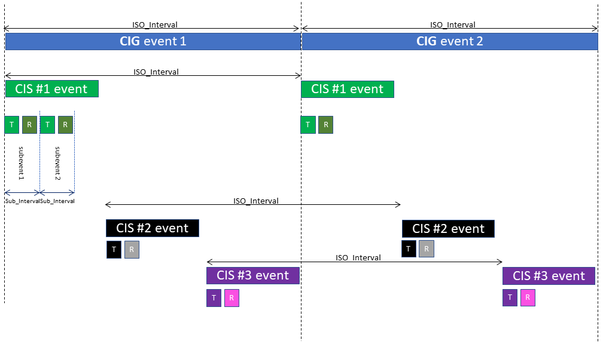
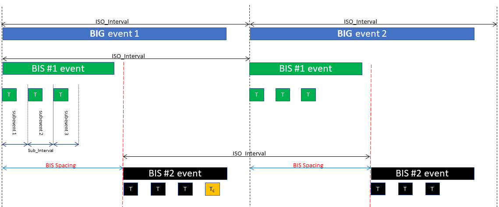

:::info

这一部分突出了等时通信的关键方面。有关更多信息，建议参阅 Nick Hunn 撰写的《介绍蓝牙LE音频》一书。该书以电子形式免费提供下载，链接为https://www.bluetooth.com/bluetooth-resources/leaudio-book/ 。蓝牙核心规范包含了详细的信息。

:::

## 基础

等时通信提供了一种使用 BLE 在设备之间传输时间受限数据的方式。它提供了一种机制，**允许多个接收设备在不同的时间接收来自相同源的数据来同步其对数据的处理**。LE 音频使用等时通信。

在使用等时通信时，数据是有有效期的，到期后被视为过期。尚未传输的过期数据将被丢弃。这意味着设备只接收符合其年龄和可接受延迟规则的有效数据，这些规则可能由某个配置文件表达。

数据以等时流的形式传输，而这些流属于等时组。设备等待一段时间，以便同一组中的所有流都有机会在同时处理接收到的数据包之前传递相关的数据包。例如，立体声音乐可以使用两个流传递，一个用于左声道，另一个用于右声道。这两个流将是同一组的成员，因此，从两个流接收到的数据包将在同一时间进行处理，以便用户以预期的方式听到立体声音乐。

定义了使用 BLE 等时物理信道的两个逻辑传输。连接等时流（LE CIS 或简称 CIS）使用面向连接的通信，支持数据的双向传输。广播等时流（LE BIS 或简称 BIS）使用无连接的广播通信，并提供数据的单向通信。

## 连接等时流（Connected Isochronous Streams）

### CIS 概览

单一 CIS 流为两个连接设备提供点对点等时通信和传输链路层数据 CIS PDU。图 1 中呈现了 LE-CIS（CIS） 逻辑传输的整体传输架构。

定义了两个逻辑链路，LE-S 和 LE-F，并提供对非帧（LE-S）和帧（LE-F）数据的支持。LE-S 与 LE-F 的使用是等时适应层的关注点。

CIS 流使用 LE 等时物理信道，并可以使用任何蓝牙 LE PHY。CIS 支持双向通信，并使用确认协议。

CIS 流是连接等时组（CIGs）的成员，每个组可能包含 1 个或多个 CIS。请参见图 2。

每个 CIG 最多可以包含31个 CIS。中央设备可以创建多个 CIGs。然而，可用的空气时间和其他实现细节通常会将这些限制降低到较低的值。

### 信道使用

连接的等时流使用自适应跳频，并采用信道选择算法#2。

### 调度

CIG 及其成员 CIS 的调度由 CIG 事件、CIS 事件和子事件的系统管理。

CIG 事件表示 CIG 中属于 CIG 的 CIS 的活动调度的开始，这发生在该组中第一个 CIS 的锚点处。**CIG 事件以 ISO_Interval 参数指定的间隔发生**。

每个 CIS 事件分为一个或多个子事件。正在使用的子事件数量在一个流参数 NSE 中指示。在连接的等时流中，在子事件期间，中央发射（T）一次，外围响应（R），如图 24 所示。子事件之间间隔的持续时间由 CIS 参数 Sub_Interval 指定。**如果每个 CIS 事件只有一个子事件，则 Sub_Interval 始终设置为零，否则至少为 400 微秒但小于 ISO Interval**。

**请注意，在每个子事件中都会更改信道**。

在 CIG 事件期间，可以按顺序为每个 CIS 提供服务，也可以交错处理不同 CIS 的子事件。图 3 显示了一个包含三个 CIS 的 CIG 的示例，其中每个 CIS 都按顺序提供服务。

每个 CIS 除了<u>子事件数量（NSE）</u>之外，还有一些重要的参数，包括 <u>Flush Timeout</u>（FT）和 <u>Burst Number（BN）</u>。

* 每个有效载荷（例如，由音频编解码器（如 LC37）输出的音频数据块）都被赋予在其中成功传输的最大 CIS 事件次数（由确认指示）；这在 FT 参数中指定。在每个 CIS 事件的每个子事件中都可以尝试一次，如果在 FT 事件内未成功，则将刷新（丢弃）该数据包。
* 有时会出现多个包含不同数据（即有效载荷）的 PDU 同时可用的情况，CIS 允许在同一 CIS 事件期间传输多个不同的 PDU。每个 CIS 事件中可以处理的不同 PDU 数量在 Burst Number（BN）参数中指定。

### 同步处理

一个 CIG 有一个关联的时间参数，称为 CIG_Sync_Delay。同一 CIG 中的每个 CIS 都有一个称为 CIS_Sync_Delay 的时间参数，这在同步等时数据处理（通常是音频渲染）中被接收方使用，用于跨组中所有流的同步。接收方在渲染接收到的数据之前等待此参数中指示的时间。

如图 4 所示，每个流具有不同的 CIS_Sync_Delay 值。对于 CIG 中的第一个 CIS 流，它被设置为组级参数 CIG_Sync_Delay。对于组中的每个其他流，CIS_Sync_Delay 逐渐设置为较低的值。这意味着从组中较早服务的流接收的设备在渲染接收到的数据内容之前必须等待的时间更长，而从组中后期传输的流接收的设备则等待时间较短。

更高层次的规范，如配置文件，可能规定在计算应渲染数据的时间时使用进一步的呈现延迟，以允许考虑到本地处理延迟。这个分层延迟系统的效果是每个接收设备将在相同的时间处理接收到的数据。

### CIS 流的创建

建立连接的等时流首先需要创建一个 ACL 连接。该连接有两个目的。首先，它允许交换链路层控制 PDU。其次，它为在流建立后调度 CIS 事件提供了一个时间参考点。

中央设备始终启动创建 CIS 的过程。它通过发送一个称为 LL_CIS_REQ PDU 的链路层控制PDU 来执行此操作。一切正常的情况下，外围设备会用 LL_CIS_RSP PDU 进行回复，当中央设备随后发送 LL_CIS_IND PDU 时，流被视为已建立。这个 PDU 包含了决定 CIS 事件的定时和在渲染之前应用的延迟的重要参数。具体而言，CIS_Offset 提供了 ACL 锚点（连接事件中发送第一个数据包的时间）与流的第一个 CIS 事件之间的微秒偏移。CIG_Sync_Delay 包含总体 CIG 同步延迟值（以微秒为单位），而 CIS_Sync_Delay 包含此流要使用的同步延迟值。

流创建后，它独立于用于创建它的 ACL 连接并行运行。然而，如果 ACL 连接关闭，则必须终止相关的 CIS。

### CIS 加密

如果两个对等设备已配对，CIS 使用的链路可能会被加密。

## 广播等时流（Broadcast Isochronous Streams  ）

### BIS 概览

BIS 流提供了另一种广播等时通信模式：一个发射设备（源）与多个接收（汇）设备间的等时通信。数据以称为 BIS 数据 PDU 的链路层 PDU 进行传输。控制信息以 BIS 控制 PDU 的形式传输。

图 5 呈现了整体数据传输架构中的 LE-BIS（BIS）逻辑传输。

通过 BIS 广播的数据可以是帧化的或非帧化的，相应地定义了逻辑链路类型 LE-S 和 LE-F。LEB-C 逻辑链路携带控制信息。

BIS 流使用 LE 等时物理信道，并可以使用任何蓝牙 LE PHY。BIS 流是广播等时组（BIG）的成员，每个组可能包含 1 个或多个 BIS。请参见图 6。

**每个BIG最多可以包含 31 个 BIS。中央设备可以创建多个 BIG。** 然而，可用的空气时间和其他实现细节通常会将这些限制降低到较低的值。

**BIS 仅支持单向通信。**

与 CIS 相比，BIS 不包括确认协议。这使得 BIS 传输在本质上是不可靠的。然而，为了弥补这一点，使用了一种无条件的数据包重传系统。BIS 不需要为外围设备的响应保留时隙（与CIS 相反），因为通信是单向的。**因此，在给定的空气时间内可以安排两倍于 CIS 的子事件用于传输，从而为这些提高可靠性的重传提供了更大的机会**。此外，由于重传是在不同的子事件中发送的，它们会在不同的信道上传输。**所选的信道必须至少在上次传输的信道之外 6 MHz，这有助于减轻由于特定信道上的干扰而导致的潜在数据包丢失。**

### 信道使用

广播等时流采用信道选择算法#2 进行自适应跳频。

### 调度

BIG 及其成员 BIS 的调度由 BIG 事件、BIS 事件和子事件的系统管理。此外，为了传输与整个 BIG 相关的控制 PDU，还定义了一个特殊的控制子事件。

BIG 事件表示对属于 BIG 的 BIS 进行活动调度的开始。BIS 事件以 BIG 参数 BIS_Spacing 的倍数的间隔从 BIG 的起始（称为BIG锚点）开始。

每个 BIS 事件分为一个或多个子事件。正在使用的子事件数量在称为 NSE 的流参数中指示。在子事件期间，广播发射一个单一数据包。通信是单向的，无需接收数据包。子事件之间的间隔由 BIG 参数 Sub_Interval 指定。

对于连接的等时组，BIG 中 BIS 事件的调度可以是顺序的或交错的。

BIG 事件可能包括一个控制子事件，该子事件总是被调度为 BIG 中的最后一个子事件。

请注意，在每个子事件中都会更改信道。图 7 显示了 BIG 和 BIS 事件以及子事件的一个示例，以顺序的方式进行调度。请注意，在 BIG 事件＃1 的末尾传输了一个BIG控制子事件（标为Tc）。

### 同步处理

在 BIG 中，跨广播等时流的数据同步处理采用了与连接等时通信中使用的方法类似的方式。接收方具有关于 BIG 及其整体参数的信息，并知道他们选择接收哪个流（或哪些流）。BIG 的定时参数对所有流都应用一致。使用整体 BIG_Sync_Delay 值和BIS_Spacing 参数，接收方能够计算在处理接收到的数据之前需要等待多长时间，以便与其他流同步。

### BIS 流的创建

为了能够接收在 BIS 中广播的数据包并在与接收其他属于同一 BIG 的流的设备同时渲染或处理其内容，设备首先必须发现 BIG 及其定义的参数，例如它包含的流数量、每个流相关事件之间和子事件之间的间隔，以及用于计算定时锚点的时间偏移信息。为了支持这一点，广播设备使用周期性广播来传递所需的参数。一个称为 BIGInfo 的复合字段在 ACAD（附加控制器广播数据）字段中的 AUX_SYNC_IND PDU 中进行广播，其中包含所需的数据。

有两种 BIGInfo 可能被接收的方式。在第一种情况下，接收方必须直接同步到周期性广播列车（参见7.7.3.1基础知识），使用定义的过程接收 AUX_SYNC_IND PDU，并从 ACAD 中提取 BIGInfo。然而，扫描并与周期性广播列车同步可能在功耗方面是一个昂贵的过程。因此，在第二种情况下，设备可以将发现和与周期性广播列车同步的任务委托给另一个设备，通常是具有更大功率资源的设备。一旦获取了BIGInfo，委托扫描的设备然后通过更有效的ACL 连接将这些信息传递给希望接收广播等时流的设备。这是使用一种称为周期性广播同步传输（PAST）的过程完成的。

### BIG 加密

一个 BIG 可以被加密。这并不要求接收其 BIS 的设备与广播设备进行配对。相反，必须分发用于派生加密密钥的广播代码参数。这可以通过带外手段执行，也可以通过遵循高级别配置文件中描述的过程执行。

### 重传和可靠性

在 BIS 或 CIS 流中，可以通过在一系列子事件中对相同数据包进行重传来增强可靠性。在BIS 的情况下，重传是无条件的，而在 CIS 中，它们发生在外围设备未确认传输时。

在 BIS 的情况下，由于无需为外围设备的响应保留时隙（与 CIS 相反），因此在给定的空气时间内可以安排两倍于 CIS 的子事件用于传输，从而提供更多机会进行提高可靠性的重传。

由于重传占用不同的子事件，它们会在不同的信道上传输，并且所选的信道必须至少在上次传输的信道之外 6 MHz。这有助于减轻由于特定信道上的干扰而导致的潜在数据包丢失。

### LE Audio

LE 等时通信主要设计用于音频产品和系统。它通过从源传送到多个接收方的音频可以同时呈现的方式实现同步播放。