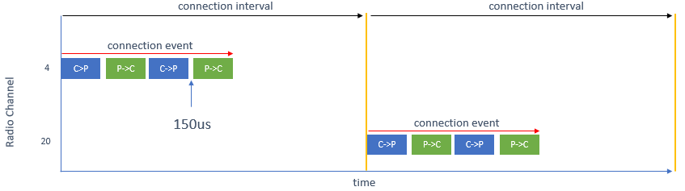
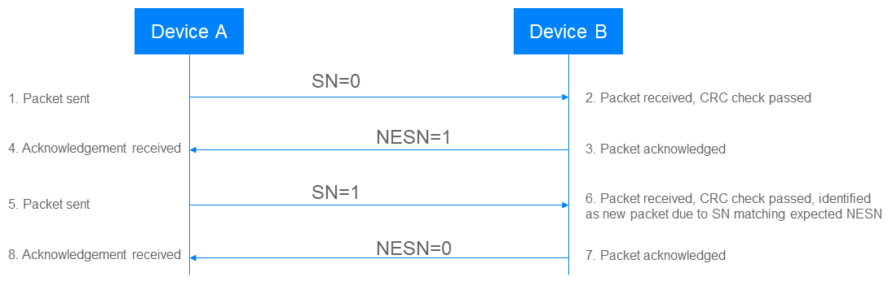
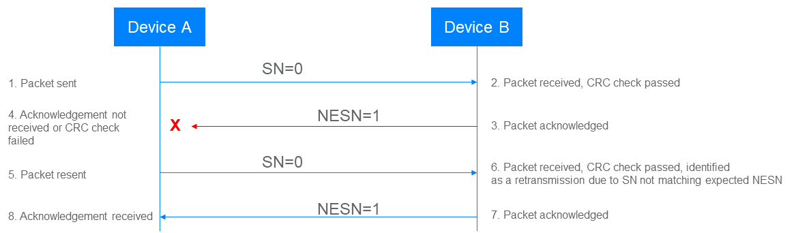
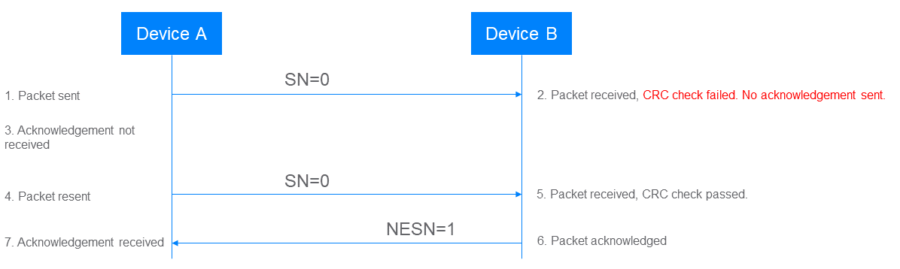
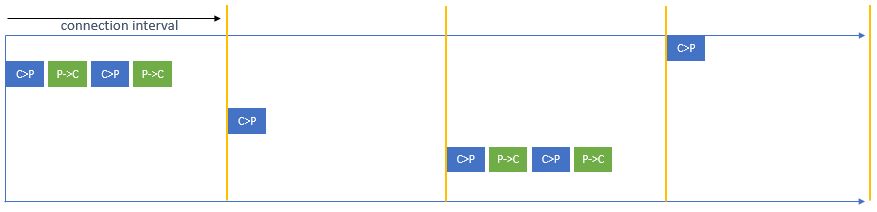
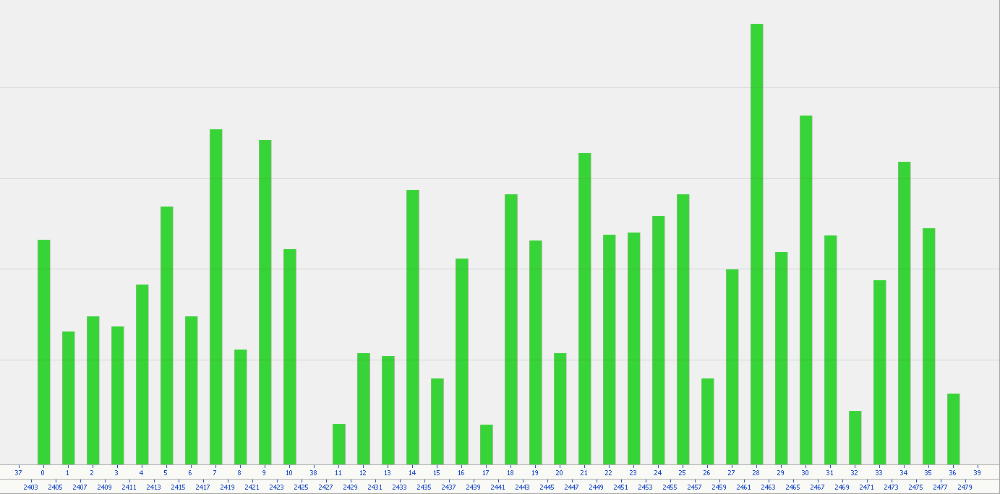
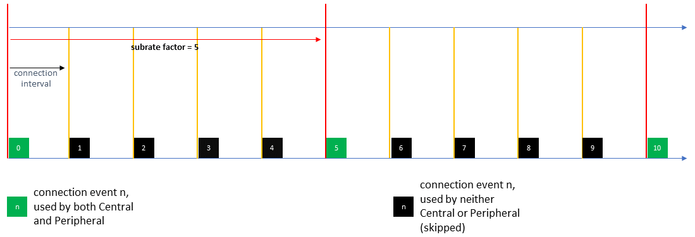

## LE ACL 异步面向连接的逻辑传输

### 基础

当两个 BLE 设备连接时，它们使用异步面向连接逻辑传输（LE-ACL 或简称 ACL）。LE-ACL 是最常用的 BLE 逻辑传输类型之一，支持面向连接的数据通信。实际上，ACL 连接通常简称为连接。

设备可以通过响应接收到的广播数据包，并携带一个请求连接的 PDU 来与广播设备建立连接。请求中指定了多个参数，其中包括<u>接入地址</u>、<u>连接间隔</u>、<u>外围设备延迟</u>、<u>监管超时</u>和<u>信道映射</u>。

**连接间隔**参数定义了*在多少毫秒内，无线电可以用于为此连接提供服务*。每当连接间隔到期时，就会开始一个连接事件，在此时，连接中的中央设备可以传输一个数据包。给定连接的每个连接事件都有一个16位的标识符，这是一个在每个事件时递增的计数器值。在每个连接事件开始时，使用适用的信道选择算法选择要使用的射频信道。

**监管超时**参数指定两个链路层数据包接收之间最长允许的时间，超过这个时间，认为链路已经丢失。

外围设备具有与中央设备相同的已同意连接参数，因此外围设备知道何时可以接收中央设备传输的数据包以及在哪个信道上接收数据包。因此，它可以选择在完全相同的时间监听该信道，从而接收中央设备的数据包。外围设备可以在接收完中央设备的数据包的最后一位后的150微秒（+/- 2µs）内回复给中央设备。中央和外围设备随后轮流进行，交替发送和接收数据包，并且在连接事件期间可以交换一定数量的数据包，该数量由实现定义。请注意，外围设备的行为可能会受到非零的外围设备延迟参数值的影响。

图 1 显示了在两个连接事件期间的基本数据包交换，其中 C>P 表示中央设备的数据包传输，P>C 表示外围设备的数据包传输。

### 有序和确认（ACK）

LE-ACL 包含一个系统，确保数据按正确的顺序处理，可以确认接收数据包，并利用这一确认来决定是继续处理下一个数据包，还是重新传输前一个数据包。

数据包含三个重要字段，有助于确保通信的可靠性。这些字段称为序列号（SN）、下一个预期序列号（NESN）和更多数据字段。这三个字段都是单比特字段，它们的使用提供了一种确认系统和检查接收到的数据包正确顺序的方法。

**通信始于**主设备（设备A）发送一个链路层数据包，<u>其中 SN 和 NESN 都设置为零</u>。从这一点开始，在每次数据包交换中，如果一切正常，由设备 A 设置的 SN 字段的值将在 0 和 1 之间交替。因此，通用设备（设备B）总是知道下一个要接收的数据包的 SN 值，并进行检查。

*如果设备 B 从设备 A 接收到具有预期 SN 值的数据包*，它会以一个链路层数据包回应，其中 NESN 被设置为逻辑值 NOT(SN)。例如，如果接收到的 SN 值为 1，那么响应中的NESN将为 0。

当设备 A 从设备 B 接收到一个响应，其中 NESN 被设置为设备 A 打算在其下一个数据包中用作SN的值时，设备A将其视为设备B的确认，证实它正确接收了上一个传输的数据包。图 2 显示了这个过程。

*如果设备 B 接收到一个带有错误 SN 值的数据包*，它会假设该数据包是先前接收到的数据包的重传，对其进行确认，但不会将其传递到协议栈的上层进行进一步处理。*如果设备 A 从设备 B 的回复中收到一个意外的 NESN 值，或者根本没有收到回复*，它会重新发送具有最初使用的相同SN值的数据包。不同的控制器实现可以自由地实现关于在何时断定通信失败之前重新发送多少次的算法。参见图 3。

每个数据包都包含一个 CRC 字段，而加密的数据包还包含一个 MIC 字段。在接收到一个数据包时，链路层会检查 CRC 和（如果存在的话）MIC。如果任一检查失败，数据包将不被确认，这通常会导致数据包的发送者重新发送它。参见图 4。

### 外围设备延迟

外围设备在每个连接事件期间并非必须监听中央设备的数据包。外围设备延迟参数定义了在这段时间内，外围设备不必监听的连续连接事件的数量，这有助于降低外围设备功耗。

图 5 展示了外围设备在外围设备延迟为 1 时的行为，因此只在交替的连接事件期间进行监听。中央设备可能会在外围设备不监听的事件中进行传输，但这样的数据包将不会被接收，因此也不会被确认，从而结束连接事件。

### 信道使用

LE-ACL 采用一种称为自适应跳频技术。在每个连接事件开始时，进行跳频，使用信道选择算法从可用信道集中确定性地选择一个射频信道。然后，连接中的每个设备将切换到所选的信道，随着时间的推移和一系列连接事件，通信将使用一系列频繁更换的不同信道进行，分布在 2.4 GHz 频段上，从而显著降低碰撞发生的概率。

在蓝牙LE定义的 40 个信道中，有 37 个信道（称为通用信道）可供 LE-ACL 连接使用。

在特定环境中，一些蓝牙射频信道可能运行不佳，可能是因为受到干扰的影响，而其他信道则可靠运行。随着环境中其他无线通信设备的进出，可靠信道和不可靠信道的列表可能会随时间而变化。

连接中的中央设备维护一个信道映射，将通用信道分类为可靠或不可靠。通过链路层过程，该信道映射与外围设备共享，以便它们都具有相同的信息，即哪些信道将被使用，哪些不会被使用。信道选择算法确保在跳频期间避免使用被标记为不可靠的信道。

默认情况下，所有通用信道都被标记为可靠，但中央设备可以使用特定于实现的技术监控每个信道的运行状况。如果中央设备确定一个或多个信道的运行状况不佳，它可以在信道映射表中将这样信道的分类更新为不可靠。相反，如果之前不良的信道现在运行良好，它的分类可以在信道映射中更新为可靠。然后，可以将信道映射更新与外围设备共享。

外围设备也可以进行自己的信道监测，并在一定间隔内向中央设备发送信道状态报告，其中每个信道的状态被分类为良好、不良或未知。然后，中央设备可以根据自己的射频条件和远程外围设备的现状，做出关于信道映射中信道分类的决策。

通过这种方式，BLE 设备可以仅使用可靠信道的最佳子集，因此例如，可以有效地与使用静态分配信道的其他无线技术共存。这就是蓝牙自适应跳频技术的自适应性。

图 6 展示了在测试期间两个连接设备使用信道的方式，并说明了射频使用如何分布在 ISM 2.4 GHz 频谱上。在图表底部，您可以看到信道索引和频率（以 MHz 为单位）。信道索引是引用射频信道的一种间接方式。

### 逻辑链路控制

链路层规范指定了许多控制程序。一些示例出现在**表三**中。

**表三. 链路层控制过程例子**

| 控制过程         | 描述                                                         |
| ---------------- | ------------------------------------------------------------ |
| 连接更新         | 允许中央设备或外围设备请求更改连接参数，包括连接间隔、外围延迟和监管超时。 |
| 信道映射更新     | 允许中央设备将其最新的信道映射数据传输给连接的外围设备。     |
| 加密             | 允许中央设备或外围设备启用数据包的加密。                     |
| 特征交换         | 允许中央设备或外围设备启动支持的每个设备的链路层特性的交换，以位图字段编码。 |
| 周期广播同步传输 | 允许中央设备或外围设备通过LE ACL连接向另一设备传输与已发现的周期广播传输有关的周期广播同步信息。 |
| CIS 创建过程     | 允许中央设备与外围设备创建连接的等时流（Connected Isochronous Stream，CIS）。 |
| 功率控制请求     | 允许一方请求另一方调整其发送功率水平。                       |
| 信道分类报告     | 允许外围设备向连接的中央设备报告信道分类数据。               |

### 子速连接（Subrated Connections）

子速连接是 LE ACL（Low Energy Asynchronous Connectionless Link）连接，其具有分配给它们的附加属性，并在某些方面表现出不同的行为。这些附加属性称为子速率因子（subrate factor）、子速率基本事件（subrate base event）和连续编号（continuation number）。

子速连接属性提供了一种机制，用于指示连接的设备只会在特定的连接事件子集上进行活跃使用，而在其他连接事件上不使用射频。因此，子速连接可以具有较短的ACL连接间隔，但仍表现出低占空比。

图 7 说明了与子速连接相关的基本概念。

在这里，我们可以看到每五个连接事件中只有一个被使用。其他四个被跳过，因此在这些连接事件中没有射频活动。被使用与被跳过的连接事件的比例由子速率因子参数确定，在这个例子中设置为 5。射频用于传输和接收链路层数据包的连接事件被称为子速连接事件。

考虑到底层 ACL 连接参数与控制连接子速率的参数之间的关系，可以将子速连接视为具有控制 ACL 连接事件发生频率的连接间隔，以及有效连接间隔的连接。有效连接间隔确定在应用子速率参数之后实际使用这些 ACL 连接事件的频率。

子速连接使用一组不同的链路层控制过程，特别是用于更新子速连接参数的过程与一般的控制更新过程有所不同。至关重要的是，对子速连接参数的更改几乎可以立即应用，而一般参数更改可能需要很长时间才能生效。因此，子速连接的优势在于可以建立持久连接，表现出低占空比并消耗较少功率，而且可以在几乎没有用户能察觉的延迟下切换到高占空比、高带宽的连接。这种能力在一些LE音频场景中，如涉及助听器和智能手机的场景中具有特殊适用性。

《蓝牙核心规范版本 5.3 功能增强》文档有一个专门讨论子速连接的重要章节，强烈推荐作为进一步了解此主题的信息来源。