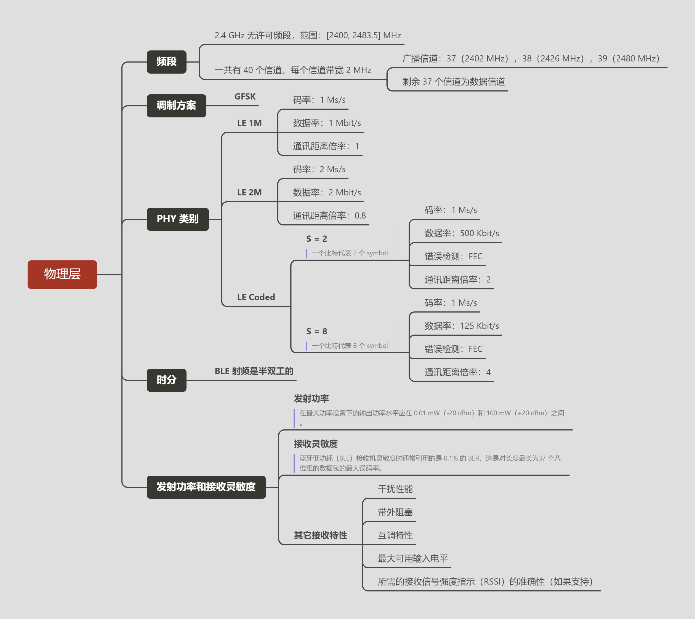
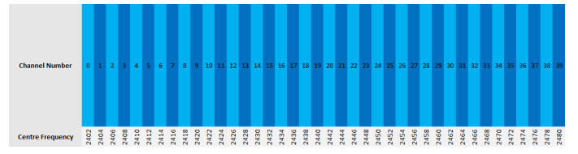
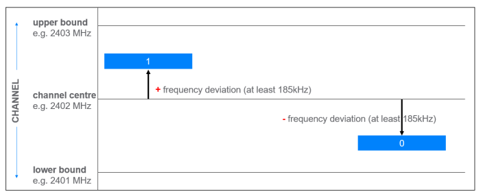

## 思维导图

BLE 物理层定义了进行数据传输和接收时，如何使用无线电发射器/接收器对数据进行编码和解码。并且还包括其它适用于无线电相关的参数和属性。

## 频段

BLE 的工作频段是从 2400 MHz 到 2483.5 MHz 之间的 2.4 GHz 无许可频段。BLE 的工作频段被划分为 40 个信道，每一个信道的带宽为 2 MHz。链路层和数据传输架构定义了信道的使用方式。

## 调制方案

为了在传输前编码来自上次协议栈的数字数据以及解码接收到的无线信号，BLE 使用 GFSK 调频技术[^gfsk]。GFSK 的工作原理是通过将选择的信道中心频率（载波）上移指定的量来表示数字值 1，或者下移相同的量来表示二进制值 0。对信号进行高斯滤波以减少频率突然变化而造成的噪声。

图 2. 展示了基本的**频率偏移调制**过程。请注意，频率偏移的量被称为频率偏差，至少为 ±185 kHz 或至少为 370 kHz，具体取决于使用的 PHY 类别。

## PHY 类别

BLE 中定义了三种调制方案，物理层传输速度单位是 sym/s 而不是 bit/s。因为物理层今处理模拟无线电特征，而不涉及数字概念。BLE 使用二进制调制方案，这意味着一个模拟信号表示一个数字。

BLE 三种 PHY 类别汇总：

* **LE 1M**：
  * 1 Msym/s 码率
  * 频率偏差至少是 185 kHz 并且不使用特殊编码
  * 所有的设备都必须支持
* **LE 2M**：
  * 2 Msym/s 码率
  * 频率偏差至少是 370 kHz 并且不使用特殊编码
* **LE Coded**：
  * 1 Msym/s 码率
  * 受制于链路层的前向纠错码（FEC），FEC 可以传输的有效范围但是降低了应用数据率。

<table>
    <caption>三种 PHY 的对比</caption>
    <tr>
        <th rowspan="2"></th>
        <th rowspan="2">LE 1M</th>
        <th colspan="2">LE Coded</th>
        <th rowspan="2">LE 2M</th>
    </tr>
    <tr>
        <td>S=2</td>
        <td>s=8</td>
    </tr>
    <tr>
        <th>码率</th>
        <td>1 Ms/s</td>
        <td>1 Ms/s</td>
        <td>1 Ms/s</td>
        <td>2 Ms/s</td>
    </tr>
    <tr>
        <th>协议数据速率</th>
        <td>1 Mbit/s</td>
        <td>500 Kbit/s</td>
        <td>125 Kbit/s</td>
        <td>2 Mbit/s</td>
    </tr>
    <tr>
        <th>估计最大数据速率</th>
        <td>800 kbps</td>
        <td>400 kbps</td>
        <td>100 kbps</td>
        <td>1400 kbps</td>
    </tr>
    <tr>
        <th>错误检测</th>
        <td>CRC</td>
        <td>CRC</td>
        <td>CRC</td>
        <td>CRC</td>
    </tr>
    <tr>
        <th>纠错</th>
        <td>无</td>
        <td>FEC</td>
        <td>FEC</td>
        <td>无</td>
    </tr>
    <tr>
        <th>通讯距离倍率</th>
        <td>1</td>
        <td>2</td>
        <td>4</td>
        <td>0.8</td>
    </tr>
</table>

## 时分

BLE 射频是半双工的，可以进行传输和接收，但是不能同时进行。然而，所有的 PHY 都采用时分双工（TDD）方案实现近似全双工。

## 发射功率和接收灵敏度

物理层定义了发射特性，包括最大输出功率的要求，规范规定：

* 在最大功率设置下的输出功率水平应在 0.01 mW（-20 dBm）和 100 mW（+20 dBm）之间。

接收机灵敏度定义为接收机在指定误码率（BER）的情况下允许输入的最小电平。所指定的 BER 随接收到的数据包的长度而变化，因为链路层为每个数据包附加一个循环冗余校验（CRC）字段，并使用它作为在解码的数据包中检测一个或多个错误位的机制。由于数据包的长度各不相同，且每个数据包都有一个 CRC，因此数据包的长度会影响计算的 BER。

在讨论蓝牙低功耗（BLE）接收机灵敏度时通常引用的是 0.1% 的 BER，这是对长度最长为37 个八位组的数据包的最大误码率。

物理层定义的其他接收机特性包括干扰性能、带外阻塞、互调特性、最大可用输入电平以及所需的接收信号强度指示（RSSI）的准确性（如果支持）。

## 天线切换

BLE 支持两种计算接收到信号的方向的方法。

* 第一种方法称为到达角（AoA）；
* 第二种方法称为离开角（AoD）。

这两种方法都涉及一台设备具有天线阵列并在发送方向查找信号（AoD方法）或接收信号时切换天线。方向查找信号是标准的蓝牙数据包，其中包括一个持续音扩展（CTE）字段。
天线阵列有许多不同的设计，从一根天线切换到另一根天线可以遵循一系列不同的切换模式。这由主机控制，但物理层也定义了一些关于天线切换过程、相关接收器要求和一些有用定义的普遍适用规则。
蓝牙核心规范在第 6 卷 A 部分的第 5 节中更详细地介绍了这个主题。有关 AoA 和 AoD 方向查找功能的更多信息，请参阅蓝牙核心规范第 5.1 版本功能概述文档。

## 术语

[^gfsk]: 高斯频移键控调制技术: **GFSK**是一种[频率偏移调变](https://zh.wikipedia.org/wiki/頻率偏移調變)技术，其技术以[FSK](https://zh.wikipedia.org/wiki/頻率偏移調變)为基础。当原始数字信号在经过[FSK](https://zh.wikipedia.org/wiki/頻率偏移調變)调变送出前，加上一个[高斯低通滤波器](https://zh.wikipedia.org/w/index.php?title=高斯低通濾波器&action=edit&redlink=1)来限制调变后的信号频谱宽度，使得在通讯上能限制频谱宽度的传输以及功率的消耗。
