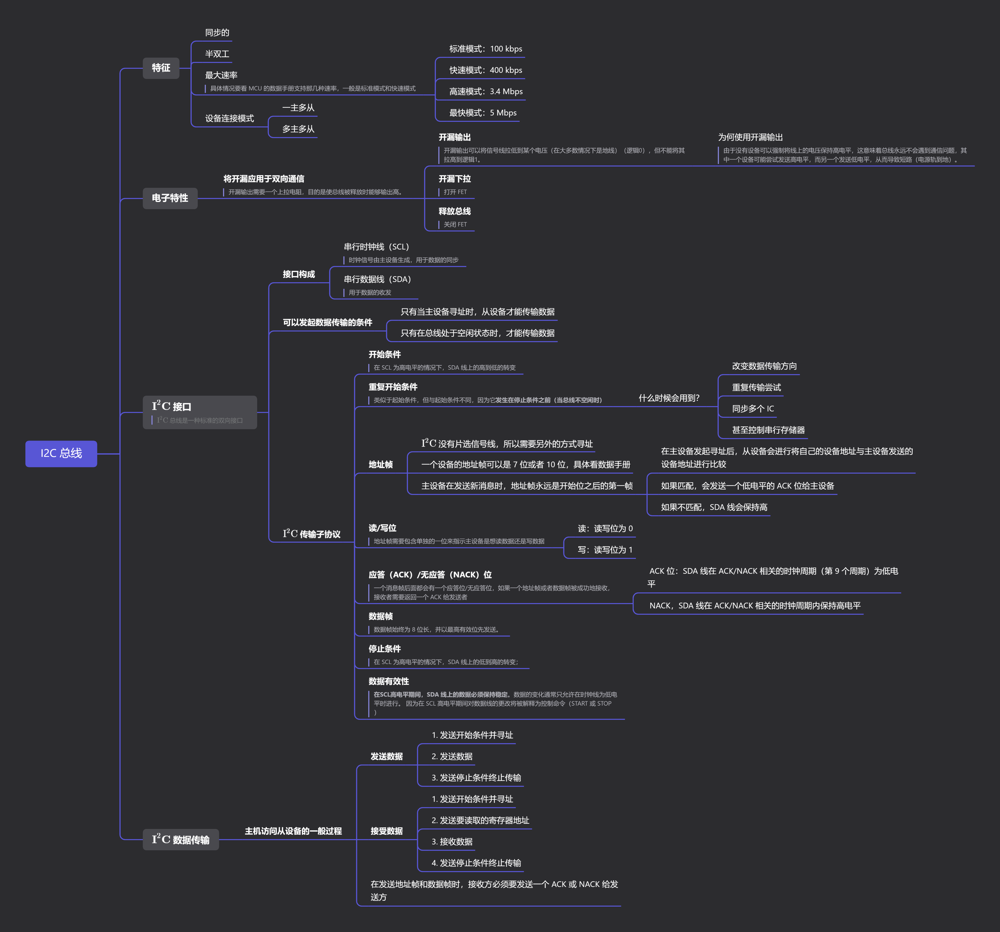
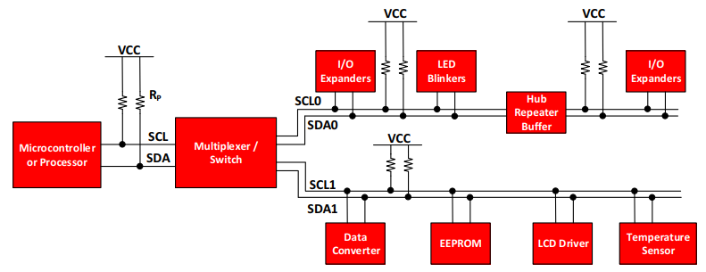
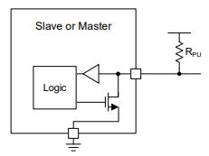
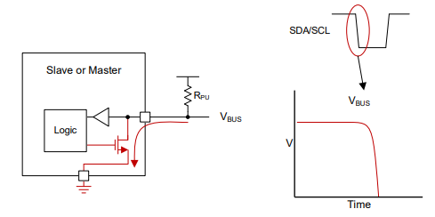
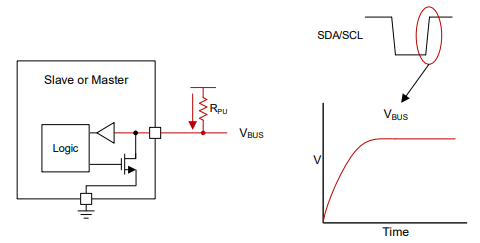
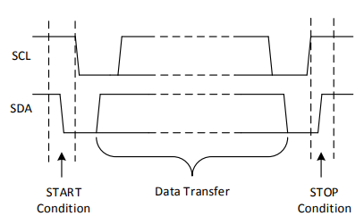
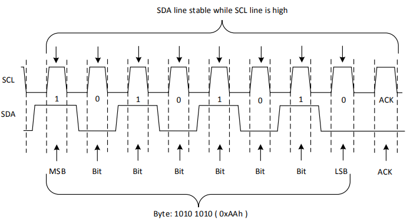
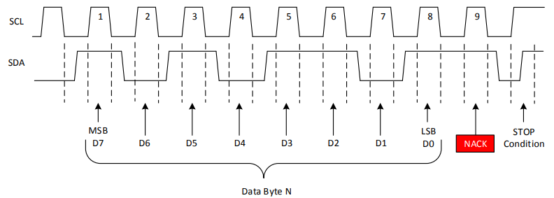
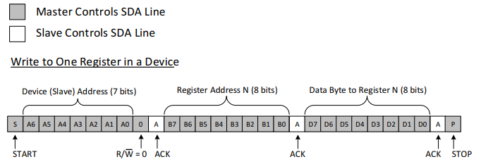
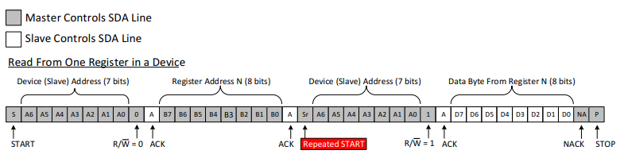

## 思维导图

## 简介

Inter-Integrated Circuit（$\text{I}^2\text{C}$）总线是由飞利浦公司最初为消费品开发的一种双线串行接口。它是一种半双工总线，可以轻松在任何 IC 工艺（NMOS、CMOS、双极）中实现，并允许简单的 IC 间通信。通过使用串行数据线（SDA）、串行时钟线（SCL）和共同的地线来进行通信，可以最小化连接。$\text{I}^2\text{C}$ 已经得到了广泛使用，并且甚至作为系统管理总线（SMBus）的原型，SMBus 是 $\text{I}^2\text{C}$ 的一个子集。

图 2. 显示了嵌入式系统中的典型 $\text{I}^2\text{C}$ 总线，其中使用了多个从设备。微控制器代表 $\text{I}^2\text{C}$ 主控，并控制 IO 扩展器、各种传感器、EEPROM、ADC/DAC 等等。所有这些设备只使用主控的 2 个引脚进行控制。

## 电子特性

$\text{I}^2\text{C}$ 使用开漏[^open-drain]/开集[^open-collector]电极结构，并在同一条线上具有输入缓冲器，这使得可以使用单个数据线进行双向数据流。

### 开漏用于双向通信

在总线被主设备或从设备释放的情况下，线上的上拉电阻（$R_{PU}$）负责将总线电压拉高到电源轨。由于没有设备可以强制将线上的电压保持高电平，这意味着总线永远不会遇到通信问题，其中一个设备可能尝试发送高电平，而另一个发送低电平，从而导致短路（电源轨到地）。$\text{I}^2\text{C}$ 要求在多主环境中，如果主设备发送高电平，但看到总线处于低电平状态（另一个设备正在拉低它），则停止通信，因为另一个设备正在使用总线。推挽（push-pull）接口不允许这种自由度，这是 $\text{I}^2\text{C}$ 的一个优点。

图 3 显示了 SDA/SCL 线上从设备或主设备的内部结构的简化视图，包括用于读取输入数据的缓冲区和用于传输数据的下拉场效应晶体管（FET）。**设备只能将总线拉低（提供短接到地）或释放总线（高阻抗到地），并允许上拉电阻将电压提高**。 这是处理 $\text{I}^2\text{C}$ 设备时要意识到的一个重要概念，因为没有设备可以将总线线保持高电平。这个特性是实现双向通信的关键。

#### 开漏下拉

如上所述，开漏设置只能将总线拉低，或者“释放”它并让一个电阻将其拉高。图 4 显示了拉低总线的电流流动。想要传输低电平的逻辑将激活下拉场效应晶体管，它会提供一个通向地的短路，将总线拉低。

#### 开漏释放总线

当从设备或主设备希望发送逻辑高电平时，它只能通过关闭下拉场效应晶体管来释放总线。这会使总线悬空，上拉电阻将电压拉高到电压轨，被解释为高电平。图 5 显示了通过上拉电阻的电流流向，将总线拉高。

## I2C 接口

### I2C 的一般操作

$\text{I}^2\text{C}$ 总线是一种标准的双向接口，使用 $\text{I}^2\text{C}$ 总线进行通信的设备类型分为主设备和从设备，生成时钟信号的被称为主设备。**除非被主设备寻址，否则从设备不能传输数据**。<u>$\text{I}^2\text{C}$ 总线上的每个设备都有一个特定的设备地址，以区分其他在同一$\underline{\text{I}^2\text{C}}$总线上的设备</u>。许多从设备在启动时需要配置，以设置设备的行为。这通常是在主控访问从设备的内部寄存器映射时完成的，这些映射具有唯一的寄存器地址。一个设备可以有一个或多个寄存器，其中存储、写入或读取数据。

$\text{I}^2\text{C}$ 接口由串行时钟线（SCL）和串行数据线（SDA）组成。SDA 和 SCL 线都必须通过上拉电阻连接到 VCC。上拉电阻的大小取决于 $\text{I}^2\text{C}$ 线上的电容量（有关详细信息，请参阅$\text{I}^2\text{C}$ 上拉电阻计算（[SLVA689](https://www.ti.com/lit/an/slva689/slva689.pdf?ts=1704303283417)））。**只有在总线处于空闲状态时，才能传输数据**。如果在 STOP 条件后 SDA 和 SCL 线都为高电平，那么总线被视为空闲。

主机访问从设备的一般过程如下：
1. 如果主机想要向从设备发送数据：
   - 主机发送开始条件（START condition）并寻址从设备
   - 主机发送数据给从设备
   - 主机发送停止条件（STOP condition）终止传输
2. 如果主机想要从从设备接收/读取数据：
   - 主机发送开始条件并寻址从设备
   - 主机发送要读取的寄存器地址给从设备
   - 主机接收从设备的发送的数据
   - 主机发送停止条件终止传输

#### 开始和停止条件

$\text{I}^2\text{C}$ 通信由主机发送开始条件（START condition）开始，并由主机发送停止条件（STOP condition）终止。

* 开始条件：在 SCL 为高电平的情况下，SDA 线上的高到低的转变；
* 停止条件：在 SCL 为高电平的情况下，SDA 线上的低到高的转变。

#### 重复开始条件

重复开始条件（repeated START condition）类似于开始条件，<u>用于替代后续的停止条件（STOP condition）再开始条件（START condition）</u>。它看起来与开始条件相同，但与开始条件不同，因为它**发生在停止条件之前（当总线不空闲时）**。这对于主机希望开始新的一轮通信但不希望通过停止条件使总线空闲的情况很有用，这有可能导致主机失去对总线的控制权，被另一主机（在多主机环境中）接管。

### 数据的有效性[^data-validity]和字节格式[^byte-format]

在每个SCL时钟脉冲期间传输一个数据位。一个字节由 SDA 线上的八个比特组成。一个字节可以是设备地址、寄存器地址或从从设备写入或读取的数据。数据以最高有效位（MSB）优先的顺序传输。在 START 和 STOP 条件之间，可以从主设备传输任意数量的数据字节。**在 SCL 高电平期间，SDA 线上的数据必须保持稳定**，因为在SCL高电平期间对数据线的更改将被解释为控制命令（START 或 STOP）。

### 应答（ACK）和无应答（NACK）

每个数据字节（包括设备地址字节）后都会跟随接收方发送的一个 ACK 位。ACK 位允许接收方向发送方传达字节已成功接收，可以发送另一个字节。

在接收方发送 ACK 之前，发送方必须释放 SDA 线。**为了发送一个 ACK 比特，接收方应在ACK/NACK 相关的时钟周期（第 9 个周期）的低电平期间拉低 SDA 线**，以便在 ACK/NACK 相关的时钟周期的高电平期间，SDA 线保持稳定低电平。需要考虑设置时间和保持时间。

**当 SDA 线在 ACK/NACK 相关的时钟周期内保持高电平时，这被解释为 NACK**。有几种情况会导致生成 NACK：

1. 接收方由于执行某些实时功能且尚未准备好与主机开始通信，因此无法接收或传输。
2. 在传输过程中，接收方收到其不理解的数据或命令。
3. 在传输过程中，接收方无法接收更多的数据字节。
4. 主机通过向从设备发送 NACK 表示完成读取数据。

## I2C 数据

寄存器是从设备内存中存储信息的位置，无论是配置信息还是要发送回主设备的一些采样数据。主设备必须将信息写入这些寄存器，以指示从设备执行任务。虽然在 $\text{I}^2\text{C}$ 从设备中拥有寄存器是很常见的，但请注意，并非所有从设备都有寄存器。有些设备很简单，只包含一个寄存器，可以通过在从地址后立即发送寄存器数据来直接写入。单寄存器设备的示例是通过 $\text{I}^2\text{C}$ 命令进行控制的 8 位 $\text{I}^2\text{C}$ 开关。由于它只有一个位用于启用或禁用通道，因此只需要一个寄存器，主设备只需在从地址后写入寄存器数据，跳过寄存器地址。

### 向从设备寄存器写入

要在 $\text{I}^2\text{C}$ 总线上写入，

1. 主设备需要在总线上发送一个带有从设备地址的开始条件，以及设备地址的后一位（R/$\overline{\text{W}}$ 位）设置为 0，表示写入。
   一个 7 位地址是 0x2D，添加一个等于 0 的写入位，它将变为 0x5A（先将地址帧左移一位，然后逻辑或上读写位）。
2. 在从设备匹配到主机发送的地址后，会返回应答位给主设备；
3. 主设备将发送要写入的寄存器地址。从设备将再次应答，告诉主设备它已经准备好。
4. 之后，主设备将开始向从设备发送寄存器数据，直到主设备发送完所有需要的数据（有时这只是一个字节），然后主设备将发送停止条件来终止传输。

图 9 显示了向从设备寄存器写入单个字节的示例。

### 从从设备寄存器读取

从从设备读取数据与向从设备寄存器写入非常相似，但有一些额外的步骤。为了从从设备读取数据，

1. 主设备首先必须指示想要读取哪个从设备的寄存器数据。这是通过主设备以类似写入的方式开始传输来完成的，即发送带有 R/$\overline{\text{W}}$ 位等于 0 的地址（表示写入）；
2. 然后是它希望从中读取的寄存器地址；

3. 一旦从设备确认了这个寄存器地址，主设备将再次发送一个开始条件，然后是带有 R/$\overline{\text{W}}$ 位设置为 1 的从设备地址（表示读取）。

4. 这次，从设备将确认读取请求，主设备释放 SDA 总线，但将继续向从设备提供时钟。在此事务的这个部分，主设备将变为接收方，从设备将变为发送方。

5. 主设备将继续发送时钟脉冲，但会释放 SDA 线，以便从设备可以传输数据。在每个数据字节的末尾，主设备将向从设备发送一个 ACK，让从设备知道它已经准备好传输更多数据。

6. 一旦主设备收到了它所期望的字节数，它将发送一个 NACK，向从设备发出信号停止通信并释放总线。主设备随后发送一个停止条件给从设备。

从从设备寄存器读取单个字节如图 10 所示。

## 参考文献

[1] Jonathan Valdez, Jared Becker. "[Understand the $\text{I}^2\text{C}$ Bus]()", Texas Instruments Incorporated, June 2015. 

## 术语

[^open-drain]: 开漏: 一种输出类型，开漏输出可以将信号线拉低到某个电压（在大多数情况下是地线）（逻辑0），但不能将其拉高到逻辑1。为了实现高状态，需要外部上拉电阻。当输出处于高阻态时，上拉电阻将信号线拉到高电平。
[^open-collector]: 开集: 类似于开漏，开集电极输出可以将信号线拉低，但需要外部上拉电阻将线拉高。主要区别在于使用的技术（晶体管类型）。
[^data-validity]: 数据有效性: 是由数据线（SDA）在时钟线（SCL）稳定时的变化来确定的。在SCL（时钟线）的高电平期间，SDA线上的数据应该维持不变，任何变化都会被解释为控制命令，如 START 或 STOP。这是因为在 $\text{I}^2\text{C}$ 通信中，数据的变化通常只允许在时钟线为低电平时进行。
[^byte-format]: 字节格式: 数据在 $\text{I}^2\text{C}$ 总线上以 8 位字节的形式传输，每个字节后面跟随一个应答（ACK）位
