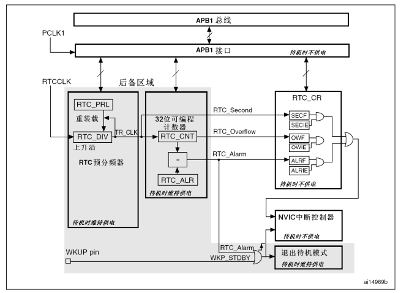

## RTC 简介

实时时钟是一个独立的定时器。 RTC 模块拥有一组连续计数的计数器，在相应软件配置下，可提供时钟日历的功能。修改计数器的值可以重新设置系统当前的时间和日期。
RTC 模块和时钟配置系统（RCC_BDCR 寄存器）处于后备区域，即在系统复位或从待机模式唤醒后， RTC 的设置和时间维持不变。
系统复位后，对后备寄存器和 RTC 的访问被禁止，这是为了防止对后备区域(BKP)的意外写操作。执行以下操作将使能对后备寄存器和 RTC 的访问：

* 设置寄存器 RCC_APB1ENR 的 PWREN 和 BKPEN 位，使能电源和后备接口时钟；

* 设置寄存器 PWR_CR 的 DBP 位，使能对后备寄存器和 RTC 的访问。

## 功能描述

RTC由两个主要部分组成(参见下图)。

* 第一部分(APB1 接口)用来和 APB1 总线相连。此单元还包含一组 16 位寄存器，可通过APB1 总线对其进行读写操作。 APB1 接口由 APB1 总线时钟驱动，用来与 APB1 总线接口。
* 另一部分(RTC 核心)由一组可编程计数器组成，分成两个主要模块。
  * 第一个模块是 RTC 的预分频模块，它可编程产生最长为 1 秒的 RTC 时间基准TR_CLK。 RTC 的预分频模块包含了一个 20 位的可编程分频器(RTC 预分频器)。如果在 RTC_CR 寄存器中设置了相应的允许位，则在每个 TR_CLK 周期中 RTC 产生一个中断(秒中断)。
  * 第二个模块是一个 32 位的可编程计数器，可被初始化为当前的系统时间。
  * 系统时间按 TR_CLK 周期累加并与存储在 RTC_ALR 寄存器中的可编程时间相比较，如果 RTC_CR 控制寄存器中设置了相应允许位，比较匹配时将产生一个闹钟中断。

## 复位过程

除了 RTC_PRL、 RTC_ALR、 RTC_CNT 和 RTC_DIV 寄存器外，所有的系统寄存器都由系统复位或电源复位进行异步复位。

RTC_PRL、 RTC_ALR、 RTC_CNT 和 RTC_DIV 寄存器仅能通过备份域复位信号复位。
